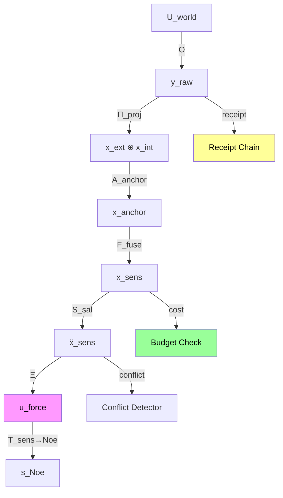

# Dual-Use Sensory Substrate Implementation Plan

## Overview

This plan implements the dual-use sensory substrate specification from the user's design document. The substrate serves two roles:
- **GM-OS role**: Boundary-and-observation system
- **GMI role**: Organism's perceptual organ

---

## Core Mathematical Framework

### Dual-Use State Space Split

```
X_sens = X_ext ⊕ X_int ⊕ X_sem ⊕ X_anchor
```

Where:
- `X_ext`: External-world percept state (o_raw, g_top, q_ext, π_src)
- `X_int`: Internal/interoceptive percept state (b, T, C, χ, H, μ)
- `X_sem`: Semantic-preparatory percept structure (ν, sal, nov, rel, ctx)
- `X_anchor`: Provenance, authority, and grounding structure

### Dual-Use Morphisms

1. **Universe-to-substrate** (GM-OS role):
   ```
   O: U_world → X_sens
   ```

2. **Substrate-to-organism** (GMI role):
   ```
   Ξ: X_sens → U_force
   ```

### Full Sensing Pipeline

```
U_world → O → y_raw → Π_proj → x_ext ⊕ x_int → A_anchor → x_anchor → F_fuse → x_sens → S_sal → ẍ_sens → Ξ → u_force → T_sens→Noe → s_Noe
```

---

## Implementation Tasks

### Task 1: Create receipt_sensory_micro.v1 Schema

**Location**: `gmos/src/gmos/sensory/receipts.py` (NEW FILE)

**Schema Fields** (per spec §15):
```json
{
  "schema_id": "receipt_sensory_micro.v1",
  "object_id": "gmos.sensory.substrate.core.v1",
  "canon_profile_hash": "sha256:...",
  "policy_hash": "sha256:...",
  "step_type": "OBSERVE",
  "step_index": 1042,
  "chain_digest_prev": "sha256:...",
  "chain_digest_next": "sha256:...",
  "state_hash_prev": "sha256:...",
  "state_hash_next": "sha256:...",
  "source_tag": "ext",
  "authority_weight": "0.95",
  "quality_score": "0.88",
  "salience_score": "0.73",
  "observation_cost": "0.0040",
  "content_hash": "sha256:...",
  "anchor_hash": "sha256:...",
  "fusion_trace_hash": "sha256:...",
  "verdict": "ACCEPT"
}
```

**Implementation**: Create `SensoryReceipt` dataclass with:
- All required fields as strings (for frozen numeric domain)
- `to_dict()` and `from_dict()` methods
- Schema ID constant
- Reject code enum

---

### Task 2: Implement Observation Cost Law

**Location**: `gmos/src/gmos/sensory/cost_law.py` (NEW FILE)

**Mathematical Definition**:
```
Σ_obs(s) = α_obs + β_obs * Sal(s) + γ_obs * BW(s)
```

With constraint: Σ_obs(s) > 0 for every non-null percept

**Budget Enforcement** (per spec §9):
```
∑ Σ_obs(s_j) ≤ b_t  (within one macro-step)
```

**Implementation**:
- `ObservationCostLaw` class with coefficients
- `compute_cost(percept)` method
- `check_budget(budget, percepts)` method returning bool

---

### Task 3: Formalize Dual-Use Morphism Operators

**Location**: `gmos/src/gmos/sensory/operators.py` (NEW FILE)

**Operators to Implement**:

1. **ObservationOperator** (O: U_world → X_sens):
   ```python
   class ObservationOperator:
       def __call__(self, world_event: Dict) -> SensoryPercept:
           # Projects world events into sensory state
           pass
   ```

2. **IngressOperator** (Ξ: X_sens → U_force):
   ```python
   class IngressOperator:
       def __call__(self, sensory_state: SensoryState) -> ForceTerm:
           # Maps sensory objects to bounded forcing term
           # This is the "optic nerve"
           pass
   ```

3. **SemanticBridge** (T_sens→Noe):
   ```python
   class SemanticBridge:
       def __call__(self, sensory_percept: SensoryPercept) -> NoeticType:
           # Converts typed percept to Noetican semantic type
           pass
   ```

---

### Task 4: Implement Bounded-Tension Lemma

**Location**: `gmos/src/gmos/sensory/tension_bounds.py` (NEW FILE)

**Mathematical Statement**:
If:
- |s|_sens ≤ S_max
- |Ξ(s)|_L² ≤ K_Ξ |s|_sens

Then for admissible θ ∈ H¹(M):
```
|ΔV| ≤ C(|θ|_H¹, S_max, |C|, ...) < ∞
```

**Implementation**:
- `BoundedTensionLemma` class
- `verify_bounded_tension(sensory_input, theta_field)` method
- Returns (is_bounded, bound_value, details)

---

### Task 5: Create Sensory Verifier (RV_sens)

**Location**: `gmos/src/gmos/sensory/verifier.py` (NEW FILE)

**Verification Checks** (per spec §16):
1. Schema ID validation
2. Canon profile hash validation
3. Policy hash validation
4. Chain digest linkage
5. State hash linkage
6. Source tag validity (in {ext, int, mem, sim})
7. Numeric parse validity
8. Observation cost positivity (Σ > 0)
9. Salience bounds (0 ≤ sal ≤ 1)
10. Anchor / provenance consistency

**Reject Codes**:
- `INVALID_SCHEMA`
- `INVALID_HASH`
- `INVALID_CHAIN`
- `INVALID_SOURCE_TAG`
- `INVALID_NUMERIC`
- `COST_NOT_POSITIVE`
- `SALIENCE_OUT_OF_BOUNDS`
- `ANCHOR_MISMATCH`

---

### Task 6: Implement Fusion Law with Provenance

**Location**: `gmos/src/gmos/sensory/fusion.py` (EXTEND EXISTING)

**Mathematical Definition**:
```
F_fuse(s₁, ..., s_n) = (∑ᵢ wᵢ φᵢ, {provᵢ}, {authᵢ}, {conflictᵢⱼ})
```

Where weights:
```
wᵢ = aᵢ qᵢ / ∑ⱼ aⱼ qⱼ
```

**Provenance Preservation**: Fusion combines content but keeps provenance as multiset/trace.

**Implementation**:
- Extend existing `FusionEngine` class
- Add `fuse_with_provenance(percepts)` method
- Return fused percept with provenance trace

---

### Task 7: Implement Conflict Detection/Resolution

**Location**: `gmos/src/gmos/sensory/conflict.py` (NEW FILE)

**Conflict Detection**:
```
Conf(s_i, s_j) ≥ 0
```

**Resolution Rules** (per spec §11):
- If Conf(s_i, s_j) > τ_conf:
  - Option 1: Raise uncertainty
  - Option 2: Defer semantic commitment
  - Option 3: Request new observation

**Implementation**:
- `ConflictDetector` class
- `detect_conflict(p1, p2)` method
- `resolve_conflict(conflict_set, strategy)` method

---

### Task 8: Implement Salience Law

**Location**: `gmos/src/gmos/sensory/salience.py` (EXTEND EXISTING)

**Mathematical Definition**:
```
Sal(s) = α_nov Nov(s) + α_rel Rel(s) + α_urg Urg(s) + α_auth Auth(s) - α_cost ObsCost(s)
```

**Implementation**:
- Extend existing `SalienceScore` with formula
- Add coefficients as configurable parameters

---

### Task 9: Create Integration Test

**Location**: `gmos/tests/sensory/test_dual_use_pipeline.py` (NEW FILE)

**Test Cases**:
1. Full pipeline: world event → sensory state → force term
2. Receipt generation and verification
3. Budget enforcement with cost law
4. Fusion with provenance preservation
5. Conflict detection and resolution
6. Bounded tension verification

---

## File Structure Summary

```
gmos/src/gmos/sensory/
├── __init__.py           (UPDATE - add new exports)
├── receipts.py           (NEW - SensoryReceipt schema)
├── cost_law.py          (NEW - Observation cost law)
├── operators.py         (NEW - O, Ξ, T operators)
├── tension_bounds.py    (NEW - Bounded-tension lemma)
├── verifier.py          (NEW - RV_sens verifier)
├── conflict.py          (NEW - Conflict detection)
├── fusion.py            (EXTEND - Provenance preservation)
├── salience.py          (EXTEND - Salience formula)
└── pipeline.py          (NEW - Complete pipeline integration)
```

---

## Dependencies

### Existing Modules to Leverage
- `gmos.sensory.manifold` - State definitions
- `gmos.sensory.anchors` - Authority computation
- `gmos.sensory.projection` - World-to-substrate projection
- `ledger.receipt` - Base receipt infrastructure
- `ledger.oplax_verifier` - Verification patterns

### External Dependencies
- `numpy` - Numerical computations
- `hashlib` - SHA256 hashing
- `pydantic` or `dataclasses` - Schema validation

---

## Testing Strategy

1. **Unit Tests**: Each component tested in isolation
2. **Integration Tests**: Full pipeline from world event to GMI forcing
3. **Property-Based Tests**: Boundedness, budget enforcement
4. **Receipt Tests**: Schema validation, hash chain integrity

---

## Mermaid: Complete Pipeline



---

## Success Criteria

1. Receipt schema matches spec §15 exactly
2. Cost law enforces Σ > 0 and budget bounds
3. Dual-use morphisms O and Ξ implemented
4. Bounded-tension lemma verified mathematically
5. Verifier checks all 10 criteria from spec §16
6. Fusion preserves provenance trace
7. Conflict detection works with configurable threshold
8. Integration test passes full pipeline
