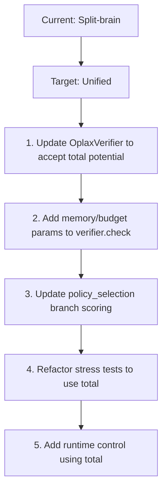
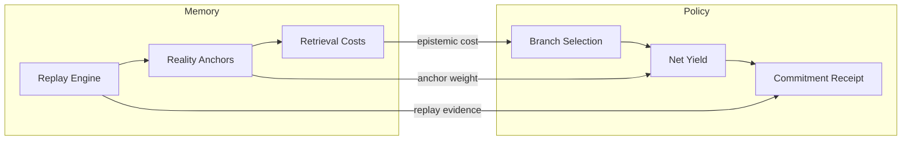

# GMI Architecture Enhancement Plan

## Executive Summary

Based on comprehensive review, the GMI codebase requires 5 key architectural enhancements to achieve conceptual and engineering maturity:

1. **Unify GMIPotential.total()** as the single source of truth
2. **Replace static reserve** with dynamic prudential formula
3. **Add explicit halting protocol** for no-admissible-moves state
4. **Convert demo tests** to proper pytest assertions
5. **Tighten memory-policy coupling** for deeper intelligence

---

## Enhancement 1: Unify GMIPotential.total() as Runtime Law

### Problem
- [`core/potential.py`](core/potential.py) defines both `base()` and `total()` methods
- `total()` correctly combines base + memory + budget_barrier + domain + episodic
- But runtime paths (verifier, branch scoring, control) still use `potential.base` instead of `potential.total`
- This creates a "split-brain" architecture

### Files Affected
- [`ledger/oplax_verifier.py`](ledger/oplax_verifier.py) - Line 93 uses `potential_fn=potential.base`
- [`runtime/policy_selection.py`](runtime/policy_selection.py) - Branch scoring uses base potential
- [`experiments/stress_tests.py`](experiments/stress_tests.py) - Tests reference `potential.base`

### Implementation Steps



**Step 1:** Modify [`ledger/oplax_verifier.py`](ledger/oplax_verifier.py)
- Change constructor to accept full `GMIPotential` object, not just `potential_fn`
- Update `check()` method to compute `V_total` using all terms

**Step 2:** Update [`runtime/policy_selection.py`](runtime/policy_selection.py)
- Branch scoring should use `potential.total()` with branch-specific memory/budget

**Step 3:** Refactor [`experiments/stress_tests.py`](experiments/stress_tests.py)
- Replace all `potential.base(x)` calls with `potential.total(x, b, memory)`

**Step 4:** Add integration tests verifying total law enforcement

---

## Enhancement 2: Dynamic Reserve Formula

### Problem
- Current reserve law: `b_prime >= b_reserve` where `b_reserve = 1.0` (static)
- This is conservative but blunt - doesn't account for context
- Need prudential reserve that scales with pressure/uncertainty

### Proposed Formula
```
b_reserve = r0 + α⋅pressure + β⋅uncertainty + γ⋅branch_load
```
Where:
- `r0` = base reserve (1.0)
- `α⋅pressure` = scales with current V(x) / V_max
- `β⋅uncertainty` = scales with branch divergence
- `γ⋅branch_load` = scales with active branch count

### Implementation

**Step 1:** Add dynamic reserve method to [`core/potential.py`](core/potential.py)

```python
def compute_reserve(
    self,
    base_reserve: float = 1.0,
    pressure: float = 0.0,
    uncertainty: float = 0.0,
    branch_load: float = 0.0,
    alpha: float = 0.5,
    beta: float = 0.3,
    gamma: float = 0.2
) -> float:
    """
    Dynamic prudential reserve that scales with context.
    
    Args:
        base_reserve: Minimum floor (r0)
        pressure: Current pressure (0-1 normalized)
        uncertainty: Branch divergence metric (0-1)
        branch_load: Active branch count (normalized)
        alpha, beta, gamma: Scaling coefficients
        
    Returns:
        Prudential reserve threshold
    """
    return base_reserve + alpha * pressure + beta * uncertainty + gamma * branch_load
```

**Step 2:** Update [`ledger/oplax_verifier.py`](ledger/oplax_verifier.py)
- Add `compute_dynamic_reserve()` method
- Modify `check()` to use dynamic reserve instead of static

---

## Enhancement 3: Explicit Halting Protocol

### Problem (from review)
> "the loop kept spinning until max_steps = 50, and the test still returned PASS because it had made some successful moves earlier"
> "That is not anti-freeze. That is soft deadlock with optimistic reporting."

### Required Behavior
When no admissible moves exist for n consecutive cycles:
1. **Emit HALT receipt** - explicit ledger record
2. **Enter torpor mode** - reduced complexity exploration
3. **Request reality contact** - external intervention
4. **Return boundary state** - explicit `TORPOR` or `HALT` status

### Implementation

**Step 1:** Add halting state enum to [`ledger/receipt.py`](ledger/receipt.py)

```python
class SystemState(Enum):
    ACTIVE = "active"
    TORPOR = "torpor"      # Reduced exploration mode
    HALT = "halt"          # Explicit halt - no moves possible
    CONTACT = "contact"    # Requesting external input
```

**Step 2:** Add halt detection to [`experiments/stress_tests.py`](experiments/stress_tests.py)

```python
def run_pressure_test_with_halt(...):
    consecutive_rejections = 0
    halt_threshold = 3  # N consecutive rejections = halt
    
    while steps_taken < max_steps:
        # ... existing logic ...
        
        if not found_move:  # All moves rejected
            consecutive_rejections += 1
            if consecutive_rejections >= halt_threshold:
                # Explicit halt protocol
                emit_halt_receipt(state, reason="NO_ADMISSIBLE_MOVES")
                enter_torpor_mode()
                return PressureTestResult.FAIL_HALT  # Or TORPOR
        else:
            consecutive_rejections = 0  # Reset on success
```

**Step 3:** Update verifier to track and report admissible moves
- Add method to count admissible moves in current state
- Return explicit status about move availability

---

## Enhancement 4: Convert Demo Tests to Proper Assertions

### Problem (from review)
> "tests/test_full_system.py returns booleans instead of asserting. Pytest warns about this."

### Files Affected
- [`tests/test_full_system.py`](tests/test_full_system.py) - Lines with `return True`

### Implementation

**Before (problematic):**
```python
def test_gr_solver_standalone():
    # ... test logic ...
    print("✓ GR Solver working")
    return True  # WRONG - should assert
```

**After (correct):**
```python
def test_gr_solver_standalone():
    # ... test logic ...
    print("✓ GR Solver working")
    assert stats['steps'] > 0, "GR Solver should execute at least one step"
    assert final_H < initial_H, "Hamiltonian should decrease"
```

**Refactoring Steps:**

1. Run pytest with `-v` to identify boolean returns
2. Replace each `return True` with meaningful assertions
3. Add failure messages to assertions
4. Ensure tests fail meaningfully on invariant violations

---

## Enhancement 5: Tighten Memory-Policy Coupling

### Problem
- Memory system has: read/write/replay, reality anchors, retrieval costs
- Policy system has: branch selection, net_yield calculation
- Coupling is shallow - policy doesn't leverage memory evidence

### Required Coupling



### Implementation

**Step 1:** Update [`runtime/policy_selection.py`](runtime/policy_selection.py)
- Add memory parameters to `Branch` class
- Modify `net_yield` to include memory costs:
```python
@property
def net_yield(self) -> float:
    """
    Net yield including memory costs.
    Y(B_i) = Γ(B_i) - Σ(B_i) - μ⋅C_mem(B_i)
    """
    memory_cost = self.metadata.get('retrieval_cost', 0.0)
    return self.expected_gain - self.simulation_cost - memory_cost
```

**Step 2:** Update [`ledger/oplax_verifier.py`](ledger/oplax_verifier.py)
- Accept memory state in `check()` method
- Include memory costs in thermodynamic inequality

**Step 3:** Add memory-aware scoring in [`memory/operators.py`](memory/operators.py)
- Expose retrieval cost functions
- Add reality anchor weight computation

---

## Implementation Priority Matrix

| Priority | Enhancement | Impact | Complexity |
|----------|-------------|--------|------------|
| P0 | 1. Unify total() | Conceptual integrity | Medium |
| P1 | 3. Halting protocol | Correctness proof | Low |
| P2 | 4. Assert tests | Engineering robustness | Low |
| P3 | 2. Dynamic reserve | Prudential behavior | Medium |
| P4 | 5. Memory-policy | Intelligence frontier | High |

---

## Risk Analysis

### Risks

1. **Breaking existing tests** - Unifying total() may break stress tests
   - Mitigation: Update tests to match new behavior

2. **Performance regression** - Dynamic reserve computation adds overhead
   - Mitigation: Cache computed values per step

3. **Overfitting to current scenarios** - Enhancements may not generalize
   - Mitigation: Add diverse test scenarios

---

## Success Criteria

After implementation:

1. ✅ All runtime paths use `potential.total()` not `potential.base`
2. ✅ Reserve scales with pressure/uncertainty/branch_load
3. ✅ Pressure test detects and reports halt state explicitly
4. ✅ All test files use proper pytest assertions
5. ✅ Policy selection incorporates memory retrieval costs
