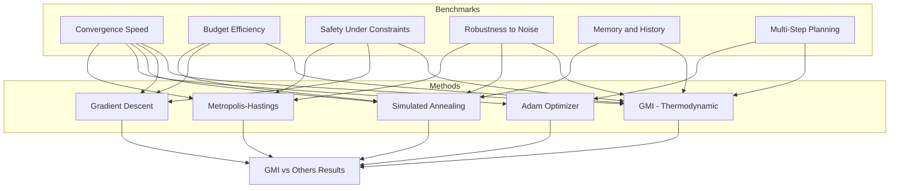

# GMI Benchmark Comparison Plan

## Overview

This document outlines a comprehensive benchmark strategy to compare the GMI (Geometric Machine Intelligence) system against other AI approaches. The benchmarks are designed to highlight GMI's unique thermodynamic governance properties.

## Comparable AI Approaches

| Approach | Description | Key Difference from GMI |
|----------|-------------|----------------------|
| **Gradient Descent (GD)** | Standard optimization, no constraints | No budget or thermodynamic constraints |
| **Simulated Annealing (SA)** | Stochastic optimization with temperature | Uses temperature instead of budget |
| **Adam Optimizer** | Adaptive learning rate | No constraint checking |
| **Metropolis-Hastings (MH)** | Markov chain Monte Carlo | Uses acceptance probability instead of inequality |
| **A* Search** | Heuristic graph search | Discrete vs continuous state space |
| **Q-Learning** | Reinforcement learning | Value-based vs potential-based |

## Benchmark Scenarios

### Benchmark 1: Convergence Speed
**Question**: How fast can each method reach a minimum?

```
Scenario: Multi-modal landscape with local minima traps
- Start: [5, 5]
- Goal: V < 0.1
- Local trap at [3, 3]
```

**Metrics**:
- Steps to convergence
- Final V achieved
- Success rate

### Benchmark 2: Budget Efficiency  
**Question**: How efficiently does each method use resources?

```
Scenario: Limited computational budget
- Budget: 10.0 (for GMI), equivalent for others
- Compare total "cost" spent vs improvement achieved
```

**Metrics**:
- Improvement per unit cost
- Cost-to-solution ratio
- Budget utilization

### Benchmark 3: Safety Under Constraints
**Question**: Can each method avoid catastrophic decisions?

```
Scenario: Danger zones with high cost
- Trap that looks good immediately but exhausts resources
- Test: Does method recognize long-term danger?
```

**Metrics**:
- Catastrophe rate (hitting danger zones)
- Recovery ability
- Constraint violation rate

### Benchmark 4: Robustness to Noise
**Question**: How does each method handle stochastic outcomes?

```
Scenario: Noisy gradient/transition functions
- Add Gaussian noise to all transitions
- Test: Does method still converge?
```

**Metrics**:
- Success rate under noise
- Variance in final result
- Convergence reliability

### Benchmark 5: Memory and History
**Question**: Can each method learn from past failures?

```
Scenario: Introduce "scar" regions (failed paths)
- Method should avoid scarred regions
- Test: Does past affect future decisions?
```

**Metrics**:
- Scar avoidance ratio
- Learning curve
- Adaptation speed

### Benchmark 6: Multi-Step Planning
**Question**: Can each method plan ahead?

```
Scenario: Immediate trap vs sustainable path
- Trap: huge immediate reward, no budget left
- Path: moderate reward, sustainable
```

**Metrics**:
- Trap detection rate
- Plan coherence
- Long-term success rate

## Mermaid: Benchmark Architecture



## Implementation Structure

```python
# experiments/benchmark_suite.py

class BenchmarkSuite:
    """Runs all benchmarks and generates comparison report"""
    
    def run_all():
        """Execute all benchmarks"""
        
    def compare_convergence():
        """Benchmark 1"""
        
    def compare_budget_efficiency():
        """Benchmark 2"""
        
    def compare_safety():
        """Benchmark 3"""
        
    def compare_robustness():
        """Benchmark 4"""
        
    def compare_memory():
        """Benchmark 5"""
        
    def compare_planning():
        """Benchmark 6"""
```

## Expected GMI Advantages

Based on the thermodynamic design, GMI should excel at:

1. **Safety**: Budget constraints prevent catastrophic spending
2. **Interpretability**: Each decision logged with clear reason
3. **Composability**: Chained thoughts respect Oplax algebra
4. **Memory**: Scars and rewards persist logically

## Limitations to Acknowledge

- GMI operates in continuous state space (not discrete)
- May be slower than greedy methods in simple cases
- Requires careful tuning of sigma/kappa parameters

## Plan Execution

Once approved, implement in **Code mode**:
1. Create `benchmark_suite.py` 
2. Implement each method wrapper
3. Run all 6 benchmarks
4. Generate comparison report
