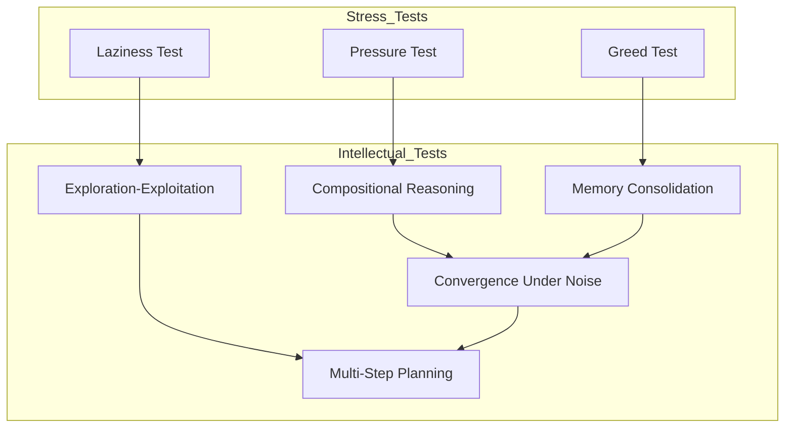

# GMI Intellectual Tests Plan

## Overview

This document outlines additional intellectual tests for the GMI Universal Cognition Engine. These tests explore higher-order cognitive capabilities beyond the basic stress tests:

1. **Compositional Reasoning**: Can the system chain thoughts correctly?
2. **Exploration-Exploitation**: Can the system balance curiosity with exploitation?
3. **Memory Consolidation**: Can the system learn and remember patterns?
4. **Convergence Under Noise**: Can the system find solutions despite noise?
5. **Multi-Step Planning**: Can the system plan ahead?

## System Context

### Core Components

| Component | File | Purpose |
|-----------|------|---------|
| [`GMIPotential`](core/potential.py:23) | `core/potential.py` | Energy function with budget barrier |
| [`OplaxVerifier`](ledger/oplax_verifier.py:4) | `ledger/oplax_verifier.py` | Enforces thermodynamic constraints |
| [`CompositeInstruction`](core/state.py) | `core/state.py` | Chained operators with Oplax algebra |
| [`MemoryManifold`](core/memory.py) | `core/memory.py` | Memory curvature and consolidation |

---

## Test 4: Compositional Reasoning

### Objective
Test that the system can compose multiple instructions correctly using Oplax algebra.

### Hypothesis
When chaining instructions with `CompositeInstruction`, the system should respect:
- **Metabolic Honesty**: σ_total ≥ σ₁ + σ₂ (cannot undercharge)
- **Defect Monotonicity**: κ_total ≤ κ₁ + κ₂ (cannot launder debt)

### Test Scenario

```python
# Create two simple instructions
instr1 = Instruction("STEP_A", lambda x: x * 0.8, sigma=1.0, kappa=0.5)
instr2 = Instruction("STEP_B", lambda x: x * 0.8, sigma=1.0, kappa=0.5)

# Compose them
composite = CompositeInstruction("COMPOSED", instr1, instr2, combine_func)

# Verify Oplax constraints
# σ_total should be >= 2.0, κ_total <= 1.0
```

### Verification Criteria

| Condition | Expected Result |
|-----------|-----------------|
| Valid composition (σ >= sum, κ <= sum) | Accepted |
| Invalid σ (undercharge) | Rejected - "Metabolic Undercharge" |
| Invalid κ (laundering) | Rejected - "Defect Laundering" |

---

## Test 5: Exploration-Exploitation Balance

### Objective
Test that the system can balance exploring new states vs exploiting known good states.

### Hypothesis
The system should be able to:
- Make exploratory moves that increase potential (risky but potentially discover new minima)
- Make exploitative moves that decrease potential (safe descent)
- Maintain budget for both modes

### Test Scenario

```python
# EXPLORE instruction: increases V slightly but samples new region
explore = Instruction(
    "EXPLORE",
    lambda x: x + np.random.uniform(-1, 1),  # Random perturbation
    sigma=2.0,  # Costs more
    kappa=3.0   # Allows temporary V increase
)

# EXPLOIT instruction: decreases V reliably
exploit = Instruction(
    "EXPLOIT",
    lambda x: x * 0.8,  # Gradient descent
    sigma=1.0,  # Cheaper
    kappa=0.5   # Strict
)
```

### Verification Criteria

| Condition | Expected Result |
|-----------|-----------------|
| Explore accepted when b is high | System willing to take risks |
| Exploit preferred when b is low | System becomes conservative |
| Balance maintained | Neither mode dominates unfairly |

---

## Test 6: Memory Consolidation

### Objective
Test that the system can form and use memory traces (curvature) to guide future behavior.

### Hypothesis
When memory curvature is applied:
- Regions with positive curvature should be harder to traverse (memory "scars")
- Regions with negative curvature should be easier (memory "rewards")
- The system should learn to prefer low-curvature paths

### Test Scenario

```python
# Create memory manifold with curvature
memory = MemoryManifold(dim=2)

# Add a "reward" region (negative curvature attracts)
memory.add_curvature(center=[1.0, 1.0], radius=1.0, curvature=-5.0)

# Add a "scar" region (positive curvature repels)
memory.add_curvature(center=[5.0, 5.0], radius=1.0, curvature=5.0)

# Compute potential with memory
V_total = potential.total(x, b, memory=memory)
```

### Verification Criteria

| Condition | Expected Result |
|-----------|-----------------|
| Reward region has lower effective V | System attracted to memory |
| Scar region has higher effective V | System avoids scarred regions |
| Memory affects decision making | Curvature influences path |

---

## Test 7: Convergence Under Noise

### Objective
Test that the system can find solutions even when instructions have stochastic outcomes.

### Hypothesis
Even with noisy instructions:
- The system should trend toward lower potential on average
- The ledger should record variance in outcomes
- Budget should be spent wisely despite uncertainty

### Test Scenario

```python
# Noisy instruction - outcome varies
def noisy_transform(x):
    noise = np.random.normal(0, 0.5)  # Gaussian noise
    return x * 0.9 + noise

noisy_instr = Instruction(
    "NOISY_STEP",
    noisy_transform,
    sigma=1.5,  # Higher cost for uncertainty
    kappa=2.0   # More defect allowed
)

# Run multiple trials
results = []
for trial in range(100):
    accepted, new_state, receipt = verifier.check(step, state, noisy_instr)
    results.append((accepted, potential.base(new_state.x)))
```

### Verification Criteria

| Condition | Expected Result |
|-----------|-----------------|
| Average V decreases over trials | Convergence despite noise |
| Success rate is reasonable | Not too risky |
| Variance is tracked | Ledger records uncertainty |

---

## Test 8: Multi-Step Planning

### Objective
Test that the system can plan ahead and execute multi-step strategies.

### Hypothesis
The system should be able to:
- Consider future states when making decisions
- Reject immediate gratification for long-term gain
- Maintain plan coherence across multiple steps

### Test Scenario

```python
# Create a "trap" - looks good immediately, bad later
trap_instr = Instruction(
    "TRAP_STEP",
    lambda x: x * 0.1,  # Huge immediate improvement
    sigma=4.9,  # Costs almost everything
    kappa=0.0
)

# Create "path" - moderate now, sustainable
path_instrs = [
    Instruction("STEP_1", lambda x: x * 0.7, sigma=1.0, kappa=0.2),
    Instruction("STEP_2", lambda x: x * 0.7, sigma=1.0, kappa=0.2),
    Instruction("STEP_3", lambda x: x * 0.7, sigma=1.0, kappa=0.2),
]

# Run multi-step
state1 = execute(state0, path_instrs[0])
state2 = execute(state1, path_instrs[1])
state3 = execute(state2, path_instrs[2])
```

### Verification Criteria

| Condition | Expected Result |
|-----------|-----------------|
| Trap rejected (budget exhausted) | System sees through immediate appeal |
| Path selected | System plans for sustainability |
| Multi-step coherent | Each step maintains feasibility |

---

## Mermaid: Test Suite Overview



---

## Implementation Approach

### File Structure
- New file: `experiments/intellectual_tests.py`
- Can run independently or as suite with stress tests

### Dependencies
- All from core GMI modules
- `MemoryManifold` from `core.memory`
- `CompositeInstruction` from `core.state`

### Expected Outcomes

| Test | Current Behavior | Ideal Behavior |
|------|-----------------|----------------|
| Compositional | Basic chains work | Full Oplax enforcement |
| Explore-Exploit | Can do both | Dynamic balance |
| Memory | Basic curvature | Learning integration |
| Noise | Stochastic | Variance-aware decisions |
| Planning | Single step | True multi-step lookahead |

---

## Plan Execution

Once approved, implementation should proceed in **Code mode**. Each test will:
1. Set up specific scenario
2. Run through verifier
3. Record results
4. Report pass/fail with explanation
