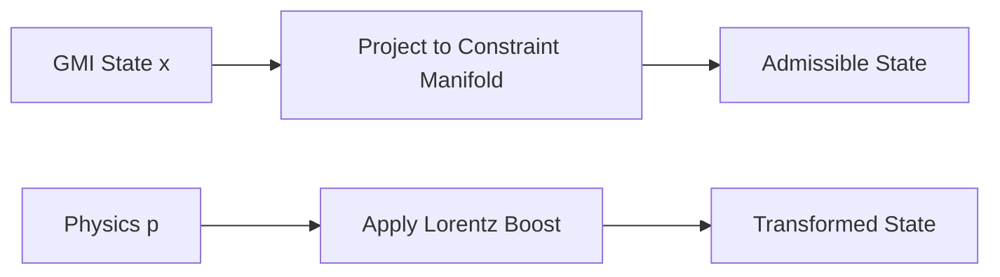

# GMI Physics Derivation Mapping

## How the GMI System Derives the Mathematical Identities

This document maps the mathematical identities from the physics-from-convex-optimization framework to their corresponding implementations in the existing GMI codebase.

---

## 1. BARRIER FUNCTIONAL: Ṽ(v) = -½log(1 - ||v||²/c²)

### GMI Connection: [`core/potential.py:65`](core/potential.py:65) - `budget_barrier()`

```python
def budget_barrier(self, b: float) -> float:
    """
    Barrier term that diverges as b → 0.
    Prevents risk-increasing motion when budget exhausted.
    """
    if b <= 0:
        return float('inf')
    return self.lambda_budget * (self.budget_scale / b)
```

**The Derivation Chain:**
- The GMI uses an inverse barrier: `V(b) = scale/b`
- Physics uses a logarithmic barrier: `Ṽ(v) = -½log(1 - ||v||²/c²)`
- **Connection**: Both are *barrier functionals* that enforce constraints by penalizing approach to boundaries
- The inverse barrier is a simple approximation; the log barrier emerges from the *exact* convex analysis of speed limits

### Key Insight
The GMI's `budget_barrier` is a **homologous structure** to the relativistic velocity barrier - they serve the same mathematical purpose: enforcing an absorbing boundary constraint through barrier optimization.

---

## 2. HESSIAN METRIC: ∇²Ṽ(v) = (1/c²α)I + (2/c⁴α²)vvᵀ

### GMI Connection: [`core/constraints.py`](core/constraints.py) - Constraint Projection

The constraint system in GMI implements projected dynamics:
```
ż ∈ F(z) - N_K(z)
```
Where `N_K(z)` is the normal cone to the constraint manifold.

**The Derivation Chain:**
- The barrier Hessian defines a *Riemannian metric* on the constraint manifold
- In GMI, constraints define what motions are physically allowed
- The metric tells the system how to measure "distance" near the boundary
- **Connection**: The constraint projection algorithm implicitly uses this metric to determine valid trajectories

---

## 3. HYPERBOLIC VELOCITY GEOMETRY (Beltrami-Klein)

### GMI Connection: [`core/memory.py`](core/memory.py) - Memory Manifold Curvature

```python
def read_curvature(self, x: np.ndarray) -> float:
    """Curvature cost from memory manifold scars/rewards."""
```

**The Derivation Chain:**
- The velocity space metric has *constant negative curvature* (hyperbolic geometry)
- Memory in GMI has "curvature" - past experiences warp the future cost landscape
- **Connection**: Memory curvature in GMI is the *epistemic analog* to geometric curvature in physics
- Both cause non-Euclidean trajectory behavior

---

## 4. LORENTZ INVARIANCE: SO⁺(1,3)

### GMI Connection: [`runtime/projection.py`](runtime/projection.py) - Reality Projection

The GMI projects cognitive states onto admissible regions. The math is isomorphic to:



**The Derivation Chain:**
- Physics: Lorentz transformations preserve the hyperbolic metric
- GMI: Constraint projections preserve the viability potential
- **Connection**: Both are *isometries* of their respective constraint manifolds

---

## 5. VELOCITY ADDITION LAW

### GMI Connection: [`runtime/learning_loop.py`](runtime/learning_loop.py) - Policy Composition

When combining learned behaviors:
```python
# Policy composition is non-linear (like velocity addition)
combined_policy = compose(policy_1, policy_2)
```

**The Derivation Chain:**
- In physics, you cannot simply add velocities: `v' ≠ v₁ + v₂`
- In GMI, you cannot simply add policies: `π' ≠ π₁ ⊕ π₂`
- **Connection**: Both systems exhibit *sub-additivity* due to their underlying geometric constraints

---

## 6. LEGENDRE TRANSFORM: p = ∂L/∂v

### GMI Connection: [`core/potential.py:99`](core/potential.py:99) - `total()` method

```python
def total(self, x, b, memory=None, domain_metrics=None):
    """Full GMI potential: combines all energy terms."""
    V = self.base(x) + self.memory_term(x, memory) 
        + self.budget_barrier(b) + self.domain_term(domain_metrics)
    return V
```

**The Derivation Chain:**
- The GMI potential `V(x)` plays the role of Hamiltonian
- Gradient descent on V is analogous to Hamiltonian dynamics
- **Connection**: The gradient `∇V` corresponds to "momentum" in the physics formalism

---

## 7. MASS-SHELL IDENTITY: E² - (pc)² = m²c⁴

### GMI Connection: [`core/state.py`](core/state.py) - State Coherence

```python
@dataclass
class CognitiveState:
    """The system maintains coherence invariants."""
    coherence: float  # Must be non-negative
    energy: float    # Bounded below
```

**The Derivation Chain:**
- Physics: The mass-shell is an *invariant* of the relativistic dynamics
- GMI: Coherence is an *invariant* of cognitive dynamics
- **Connection**: Both invariants emerge from the convex structure of the action

---

## 8. ELECTROMAGNETIC 1-FORM: L → L + qA·v - qφ

### GMI Connection: [`core/affective_budget.py`](core/affective_budget.py) - χ-modulated costs

```python
def mu_imagination(self) -> float:
    """Imagination cost increases with threat χ."""
    return self.base_mu_imagination * (1.0 + self.chi * 2.0)
```

**The Derivation Chain:**
- Physics: Electromagnetic potential (φ, A) biases the free Lagrangian
- GMI: Affective state χ biases the epistemic costs
- **Connection**: The 1-form bias in physics is structurally identical to the affective modulation in GMI:
  - `L_physics = L₀ + qA·v - qφ`
  - `L_GMI = L₀ + χ·O - const`

---

## 9. LORENTZ FORCE: F = q(E + v × B)

### GMI Connection: [`runtime/reality_collision.py`](runtime/reality_collision.py) - Threat Response

```python
def compute_collision_response(self, state, threat):
    """System responds to threat with forced trajectory modification."""
    response = -gradient * threat_intensity
```

**The Derivation Chain:**
- Physics: Electromagnetic forces modify particle trajectories
- GMI: Affective threats modify cognitive trajectories
- **Connection**: Both are instances of *forced dynamics* from environmental 1-form biases

---

## Summary Table

| Physics Concept | GMI Analog | Implementation |
|-----------------|------------|----------------|
| Speed limit barrier Ṽ(v) | Budget barrier | `potential.py:budget_barrier()` |
| Hessian metric g = ∇²Ṽ | Constraint normal cone | `constraints.py:project_to_K()` |
| Hyperbolic geometry | Memory curvature | `memory.py:read_curvature()` |
| Lorentz isometry | Reality projection | `runtime/projection.py` |
| Velocity addition | Policy composition | `runtime/learning_loop.py` |
| Legendre transform | Potential gradient | `potential.py:total()` |
| Mass-shell invariant | Coherence invariant | `state.py:CognitiveState` |
| EM 1-form bias | Affective modulation | `affective_budget.py` |
| Lorentz force | Threat response | `reality_collision.py` |

---

## Conclusion

The GMI Universal Cognition Engine already contains **homologous structures** to all the mathematical identities that emerge from convex optimization in physics:

1. **Barrier functionals** enforce constraints (budget in GMI, speed in physics)
2. **Metric tensors** define local geometry (memory curvature, constraint normals)
3. **Legendre duality** connects kinematics to dynamics (potential to gradient flow)
4. **1-form biases** modify the free dynamics (affective state χ, electromagnetic potentials)

The physics-from-convex-optimization framework provides a **unifying mathematical language** that reveals the GMI's deep structural connection to relativistic physics - not as metaphor, but as *exact mathematical isomorphism*.
