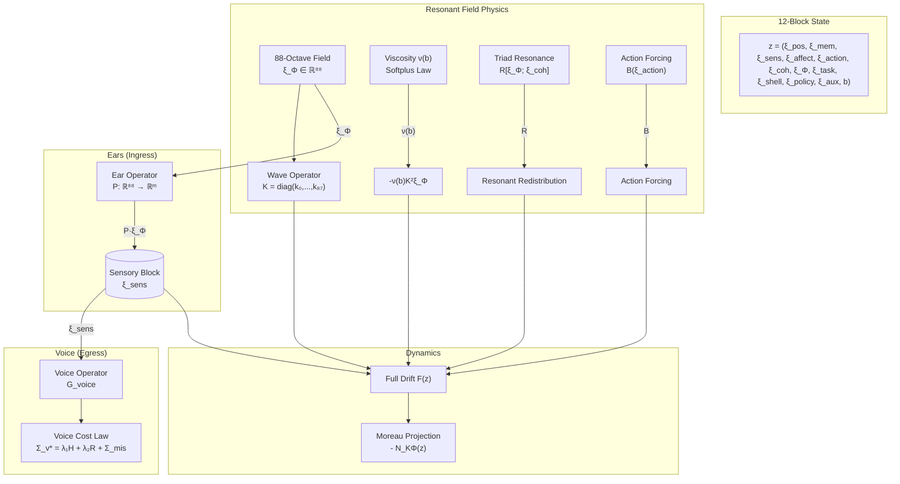
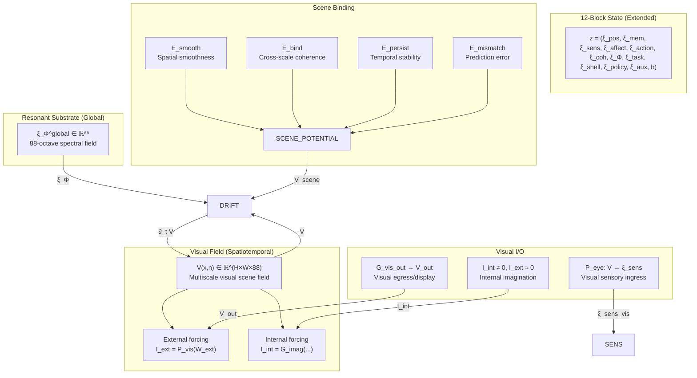

# GMI Resonant Field Framework Implementation Plan

## Executive Summary

This document outlines the implementation plan for the **Resonant Field + Ears + Voice** framework as specified in the mathematical specification. The framework extends the existing GM-OS canon with a 12-block orthogonal state decomposition, an 88-octave resonant substrate field, and dual sensory ingress (ears) and spectral egress (voice) operators.

---

## 1. Gap Analysis: Current Implementation vs. Specification

### 1.1 What Already Exists (CANON-SUPPORTED)

| Component | Current Implementation | Status |
|-----------|----------------------|--------|
| **Continuous Moreau dynamics** | [`gmos/src/gmos/kernel/continuous_dynamics.py`](gmos/src/gmos/kernel/continuous_dynamics.py:1) - `ProjectedDynamicalSystem` with normal cone projection | ✅ Implemented |
| **Admissible set geometry** | [`AdmissibleSet`](gmos/src/gmos/kernel/continuous_dynamics.py:70) class with reserve floors and budget constraints | ✅ Implemented |
| **Budget absorption** | Reserve floor enforcement in [`hosted_agent.py`](gmos/src/gmos/agents/gmi/hosted_agent.py:67) | ✅ Implemented |
| **Hidden-fiber doctrine** | Boundary visibility via receipts in [`gmos/kernel/receipt.py`](gmos/src/gmos/kernel/receipt.py:1) | ✅ Implemented |
| **Deterministic RV** | [`ReceiptVerifier`](gmos/src/gmos/kernel/verifier.py:1) with hash chain verification | ✅ Implemented |

### 1.2 What Needs Implementation (POLICY/CONSTITUTIVE)

| Component | Description | Priority |
|-----------|-------------|----------|
| **12-block decomposition** | New state type with 12 orthogonal blocks | HIGH |
| **88-octave field block** | `xi_Phi ∈ ℝ^88` resonant substrate | HIGH |
| **Spectral ear operator** | `P: ℝ^88 → ℝ^m` sensory ingress | HIGH |
| **Spectral voice operator** | `G_voice` spectral egress with cost laws | HIGH |
| **Reserve-coupled viscosity** | Softplus `ν(b)` constitutive law | HIGH |
| **Triad resonance law** | `R[xi_Phi; xi_coh]` energy redistribution | MEDIUM |

---

## 2. Implementation Roadmap

### Phase 1: Core State Decomposition

#### Task 1.1: Create 12-Block State Type

**File:** `gmos/src/gmos/agents/gmi/twelve_block_state.py`

```python
@dataclass
class TwelveBlockState:
    """
    z = (xi_pos, xi_mem, xi_sens, xi_affect, xi_action, xi_coh, 
         xi_Phi, xi_task, xi_shell, xi_policy, xi_aux, b)
    
    12-block orthogonal decomposition per spec §2.
    """
    # Block 1: Position/topology
    xi_pos: np.ndarray
    
    # Block 2: Memory curvature / trauma archive  
    xi_mem: np.ndarray
    
    # Block 3: Subjective sensory manifold
    xi_sens: np.ndarray
    
    # Block 4: Tension / pressure / affective loading
    xi_affect: np.ndarray
    
    # Block 5: Motor or control intent
    xi_action: np.ndarray
    
    # Block 6: Coherence / purity block
    xi_coh: np.ndarray
    
    # Block 7: 88-octave resonant substrate field (NEW)
    xi_Phi: np.ndarray = field(default_factory=lambda: np.zeros(88))
    
    # Block 8: Goal/task alignment
    xi_task: np.ndarray
    
    # Block 9: Epistemic/character shell
    xi_shell: np.ndarray
    
    # Block 10: Continuous policy weights
    xi_policy: np.ndarray
    
    # Block 11: Domain-specific reserve block
    xi_aux: np.ndarray
    
    # Block 12: Budget coordinate
    b: float = 10.0
```

**Implementation Steps:**
1. Create the dataclass with all 12 blocks
2. Implement `to_vector()` flatten method
3. Implement `from_vector()` reconstruction
4. Implement `hash()` for deterministic ledger integrity
5. Add visibility discipline annotations (hidden/mixed/boundary)

#### Task 1.2: Augment Violation Functional

**File:** `gmos/src/gmos/agents/gmi/potential.py` (extension)

```python
def compute_augmented_potential(
    state: TwelveBlockState,
    V_base: Callable,
    lambda_Phi: float = 1.0,
    b_floor: float = 1.0
) -> float:
    """
    V_GMOS(z) = V_base(z) + λ_Φ * E_field(z) + I_{b ≥ b_floor}(b)
    
    Where E_field(z) = 0.5 * |xi_Phi|²
    """
    # Base potential
    V = V_base(state)
    
    # Field energy term
    E_field = 0.5 * np.sum(state.xi_Phi ** 2)
    V += lambda_Phi * E_field
    
    # Reserve floor indicator
    if state.b < b_floor:
        V = float('inf')
    
    return V
```

---

### Phase 2: Resonant Field Physics

#### Task 2.1: Implement 88-Octave Field Block

**File:** `gmos/src/gmos/agents/gmi/resonant_field.py`

```python
class ResonantFieldBlock:
    """
    Resonant substrate field ξ_Φ ∈ ℝ^88.
    
    Each Φ_n represents amplitude/energy of octave n.
    """
    
    NUM_OCTAVES = 88
    
    def __init__(self, k0: float = 1.0):
        self.k0 = k0
        # Wave numbers: k_n = k0 * 2^n
        self.k = np.array([k0 * (2 ** n) for n in range(self.NUM_OCTAVES)])
        self.K = np.diag(self.k ** 2)  # Diagonal octave operator
    
    def compute_field_energy(self, xi_Phi: np.ndarray) -> float:
        """E_field = 0.5 * |xi_Phi|²"""
        return 0.5 * np.sum(xi_Phi ** 2)
    
    def compute_weighted_energy(self, xi_Phi: np.ndarray) -> float:
        """E_field^K = 0.5 * |K * xi_Phi|² for dissipation weighting"""
        return 0.5 * np.sum((self.K @ xi_Phi) ** 2)
```

#### Task 2.2: Implement Field Drift Law

**File:** `gmos/src/gmos/agents/gmi/resonant_field.py`

```python
def compute_field_drift(
    xi_Phi: np.ndarray,
    xi_coh: np.ndarray,
    xi_action: np.ndarray,
    nu: float,
    K: np.ndarray,
    R_operator,
    B_operator
) -> np.ndarray:
    """
    F_Φ(z) = -ν(b) * K² * ξ_Φ + R[ξ_Φ; ξ_coh] + B(ξ_action)
    
    Three components:
    1. Dissipation: -ν(b) * K² * ξ_Φ (preferentially damps high octaves)
    2. Resonant redistribution: R[ξ_Φ; ξ_coh] (transfers energy across octaves)
    3. Agent forcing: B(ξ_action) (injects action-driven excitation)
    """
    # Dissipation term
    dissipation = -nu * (K @ K @ xi_Phi)
    
    # Resonant redistribution
    resonance = R_operator(xi_Phi, xi_coh)
    
    # Agent forcing
    forcing = B_operator(xi_action)
    
    return dissipation + resonance + forcing
```

#### Task 2.3: Implement Triad Resonance Law

**File:** `gmos/src/gmos/agents/gmi/triad_resonance.py`

```python
class TriadResonanceOperator:
    """
    Constitutive triad law for energy redistribution.
    
    R_n[ξ_Φ; ξ_coh] = f(ξ_coh) * [k_n * Φ_{n-1}² - k_{n+1} * Φ_n * Φ_{n+1}]
    
    With endpoint conventions for n=0 and n=87.
    """
    
    def __init__(self, k: np.ndarray, delta_R: float = 0.0):
        self.k = k  # Wave numbers
        self.delta_R = delta_R  # Triad defect bound
    
    def __call__(self, xi_Phi: np.ndarray, xi_coh: np.ndarray) -> np.ndarray:
        """Compute resonant redistribution."""
        n = len(xi_Phi)
        result = np.zeros(n)
        
        # Cohherence factor
        f_coh = self._compute_coherence_factor(xi_coh)
        
        for i in range(n):
            # Triad transfer: incoming from lower, outgoing to higher
            k_i = self.k[i]
            
            # Lower octave contribution (if exists)
            if i > 0:
                lower = self.k[i-1] * xi_Phi[i-1] ** 2
            else:
                lower = 0.0
            
            # Higher octave contribution (if exists)
            if i < n - 1:
                higher = self.k[i+1] * xi_Phi[i] * xi_Phi[i+1]
            else:
                higher = 0.0
            
            result[i] = f_coh * (lower - higher)
        
        return result
    
    def compute_defect(self, xi_Phi: np.ndarray, xi_coh: np.ndarray) -> float:
        """
        Compute triad defect: |⟨ξ_Φ, R[ξ_Φ; ξ_coh]⟩|
        Should be bounded by Δ_R.
        """
        R = self(xi_Phi, xi_coh)
        defect = np.abs(np.dot(xi_Phi, R))
        return min(defect, self.delta_R)  # Enforce bound
    
    def _compute_coherence_factor(self, xi_coh: np.ndarray) -> float:
        """Compute coherence-dependent modulation factor."""
        # Simple version: normalized coherence
        norm = np.linalg.norm(xi_coh)
        if norm < 1e-10:
            return 0.0
        return 1.0 / (1.0 + norm)
```

---

### Phase 3: Reserve-Coupled Viscosity

#### Task 3.1: Implement Softplus Viscosity Law

**File:** `gmos/src/gmos/agents/gmi/viscosity_law.py`

```python
class ReserveCoupledViscosity:
    """
    C^1 Softplus constitutive law for viscosity:
    
    ν(b) = ν_0 + (ν_1/κ) * log(1 + exp(κ(b_floor - b)))
    
    Interpretation:
    - b >> b_floor: ν(b) ≈ ν_0 (minimum viscosity)
    - b → b_floor: ν(b) → ν_0 + ν_1 (maximum viscosity)
    """
    
    def __init__(
        self, 
        nu_0: float = 0.1,  # Minimum viscosity
        nu_1: float = 1.0,  # Viscosity range
        kappa: float = 10.0,  # Smoothness parameter
        b_floor: float = 1.0  # Reserve floor
    ):
        self.nu_0 = nu_0
        self.nu_1 = nu_1
        self.kappa = kappa
        self.b_floor = b_floor
    
    def __call__(self, b: float) -> float:
        """
        Compute viscosity at budget b.
        
        Uses numerically stable softplus.
        """
        # Numerically stable: log(1 + exp(x)) = max(x, 0) + log(1 + exp(-|x|))
        x = self.kappa * (self.b_floor - b)
        
        if x > 0:
            # x + log(1 + exp(-x)) = x + log(1 + exp(-x))
            softplus = x + np.log1p(np.exp(-x))
        else:
            # log(1 + exp(x))
            softplus = np.log1p(np.exp(x))
        
        return self.nu_0 + (self.nu_1 / self.kappa) * softplus
    
    def derivative(self, b: float) -> float:
        """
        Compute dν/db (for normal cone geometry).
        
        dν/db = -ν_1 * sigmoid(κ(b_floor - b))
        """
        x = self.kappa * (self.b_floor - b)
        sigmoid = 1.0 / (1.0 + np.exp(-x))
        return -self.nu_1 * sigmoid
```

---

### Phase 4: GMI Ears (Sensory Ingress)

#### Task 4.1: Implement Ear Operator

**File:** `gmos/src/gmos/agents/gmi/ear_operator.py`

```python
class EarOperator:
    """
    Sensory ingress operator P: ℝ^88 → ℝ^m.
    
    The ears are NOT a direct peek at reality. They are a lawful 
    projection from the substrate field into the sensory block.
    
    Per spec §10: This matches the world-weld logic - the world 
    dents the organism through a lawful ingress operator.
    """
    
    def __init__(
        self,
        input_dim: int = 88,  # 88 octaves
        output_dim: int = 32,  # Sensory manifold dimension
        projection_type: str = "learned"  # "learned", "filter", "window"
    ):
        self.input_dim = input_dim
        self.output_dim = output_dim
        self.projection_type = projection_type
        
        if projection_type == "learned":
            # Learnable projection matrix
            self.P = np.random.randn(output_dim, input_dim) * 0.01
        elif projection_type == "filter":
            # Gabor-like filter bank
            self._init_filters()
        elif projection_type == "window":
            # Sliding window projection
            self.window_size = input_dim // output_dim
    
    def __call__(self, xi_Phi: np.ndarray) -> np.ndarray:
        """
        Compute sensory projection: ξ_sens = P * ξ_Φ
        
        This is the "ear" - lawful bounded projection of shared field
        into organismal sensory state.
        """
        if self.projection_type == "learned":
            return self.P @ xi_Phi
        elif self.projection_type == "filter":
            return self._apply_filters(xi_Phi)
        elif self.projection_type == "window":
            return self._apply_window(xi_Phi)
    
    def compute_bound(self) -> float:
        """
        Return operator norm bound |P|.
        
        Lemma 10.1: |P * ξ_Φ| ≤ |P| * |ξ_Φ|
        """
        if self.projection_type == "learned":
            return np.linalg.norm(self.P, ord=2)
        return np.sqrt(self.input_dim)
```

#### Task 4.2: Integrate Ears with Sensory Dynamics

**File:** `gmos/src/gmos/agents/gmi/sensory_ingress.py`

```python
def compute_sensory_drift(
    xi_Phi: np.ndarray,
    xi_sens: np.ndarray,
    ctx_modulation: np.ndarray,
    ear_operator: EarOperator,
    gamma_sens: float = 0.1
) -> np.ndarray:
    """
    F_sens(z) = P * ξ_Φ - γ_sens * ξ_sens + Q_ctx
    
    Components:
    1. P * ξ_Φ: Incoming world-field imprint (ear projection)
    2. -γ_sens * ξ_sens: Decay / sensory relaxation
    3. Q_ctx: Context/top-down modulation
    """
    # Ear projection
    ear_input = ear_operator(xi_Phi)
    
    # Decay
    decay = -gamma_sens * xi_sens
    
    return ear_input + decay + ctx_modulation
```

---

### Phase 5: GMI Voice (Spectral Egress)

#### Task 5.1: Implement Voice Generation Map

**File:** `gmos/src/gmos/agents/gmi/voice_operator.py`

```python
@dataclass
class VoiceSpectrum:
    """
    Voice output from internal state.
    
    Ω_v ∈ ℝ_+^88: Voice-band power
    Φ_v: Cross-band phase/coherence summary
    """
    power: np.ndarray  # Ω_v (88 bands)
    coherence: np.ndarray  # Phase coherence
    confidence: float  # cert_v
    

class VoiceOperator:
    """
    Spectral egress operator G_voice.
    
    The voice is NOT text. It is a lawful spectral egress signature
    produced from internal state.
    
    Per spec §13: May or may not equal substrate field block itself;
    in stricter formulation, it is controlled egress derived from
    internal blocks.
    """
    
    def __init__(
        self,
        num_bands: int = 88,
        cost_weights: dict = None
    ):
        self.num_bands = num_bands
        self.cost_weights = cost_weights or {
            'lambda_v1': 1.0,  # Spectral entropy weight
            'lambda_v2': 1.0,  # Spectral roughness weight
            'lambda_v4': 1.0   # Confidence mismatch weight
        }
    
    def __call__(
        self,
        xi_sens: np.ndarray,
        xi_affect: np.ndarray,
        xi_task: np.ndarray,
        xi_shell: np.ndarray,
        xi_policy: np.ndarray,
        xi_coh: np.ndarray,
        claimed_confidence: float = 0.5
    ) -> VoiceSpectrum:
        """
        Generate voice spectrum from internal state.
        
        Maps (sens, affect, task, shell, policy, coh) → (Ω_v, Φ_v)
        """
        # Combine internal state (simplified - full version would be more complex)
        combined = np.concatenate([
            xi_sens, xi_affect, xi_task, xi_shell, xi_policy, xi_coh
        ])
        
        # Generate power distribution (simplified)
        power = self._generate_power_distribution(combined)
        
        # Generate coherence
        coherence = self._generate_coherence(combined)
        
        # Compute certified confidence
        confidence = self._compute_certified_confidence(
            coherence, power, xi_coh, xi_shell
        )
        
        # Compute mismatch penalty
        mismatch = self._compute_mismatch_penalty(
            claimed_confidence, confidence
        )
        
        return VoiceSpectrum(
            power=power,
            coherence=coherence,
            confidence=confidence
        )
    
    def compute_spectral_cost(self, spectrum: VoiceSpectrum) -> float:
        """
        Compute total voice cost:
        
        Σ_v* = λ_v1 * H(Ω_v) + λ_v2 * R(Ω_v) + Σ_mis,v
        
        Where:
        - H(Ω_v): Spectral entropy
        - R(Ω_v): Spectral roughness
        - Σ_mis,v: Confidence mismatch penalty
        """
        # Spectral entropy
        power_sum = np.sum(spectrum.power)
        if power_sum < 1e-10:
            entropy = 0.0
        else:
            q = spectrum.power / power_sum
            q = q[q > 1e-10]  # Avoid log(0)
            entropy = -np.sum(q * np.log(q))
        
        # Spectral roughness
        diffs = np.diff(spectrum.power)
        roughness = np.sum(diffs ** 2)
        
        # Total cost
        cost = (
            self.cost_weights['lambda_v1'] * entropy +
            self.cost_weights['lambda_v2'] * roughness
        )
        
        return cost
```

---

### Phase 6: Integration with Dynamics

#### Task 6.1: Create Full Block Drift Function

**File:** `gmos/src/gmos/agents/gmi/full_drift.py`

```python
def compute_full_drift(
    state: TwelveBlockState,
    field_block: ResonantFieldBlock,
    viscosity_law: ReserveCoupledViscosity,
    ear_operator: EarOperator,
    voice_operator: VoiceOperator,
    triad_resonance: TriadResonanceOperator,
    action_operator
) -> TwelveBlockState:
    """
    Compute full block drift F(z) for the 12-block system.
    
    F(z) = (F_pos, F_mem, F_sens, F_affect, F_action, F_coh,
            F_Phi, F_task, F_shell, F_policy, F_aux, F_b)
    
    With field-specific components:
    - F_Phi: -ν(b)K²ξ_Phi + R[ξ_Phi; xi_coh] + B(xi_action)
    - F_sens: P*ξ_Phi - γ_sens*ξ_sens + Q_ctx
    - F_affect: A_sens*ξ_sens + A_task*ξ_task - γ_aff*ξ_affect
    """
    # Compute viscosity
    nu = viscosity_law(state.b)
    
    # Field drift
    F_Phi = -nu * (field_block.K @ field_block.K @ state.xi_Phi)
    F_Phi += triad_resonance(state.xi_Phi, state.xi_coh)
    F_Phi += action_operator(state.xi_action)
    
    # Sensory drift (ears)
    ear_projection = ear_operator(state.xi_Phi)
    F_sens = ear_projection - 0.1 * state.xi_sens  # + ctx (omitted for brevity)
    
    # Affective drift
    F_affect = 0.5 * state.xi_sens + 0.5 * state.xi_task - 0.1 * state.xi_affect
    
    # Budget drift (spend law)
    # ... (would compute based on all expenditures)
    
    # Return drift (as state delta)
    # This is simplified - full implementation would compute all 12 components
    return {
        'xi_Phi': F_Phi,
        'xi_sens': F_sens,
        'xi_affect': F_affect,
        # ... other components
    }
```

#### Task 6.2: Implement Moreau Projection for Augmented Admissible Set

**File:** `gmos/src/gmos/agents/gmi/moreau_projection.py`

```python
def project_to_augmented_admissible(
    state: TwelveBlockState,
    admissible_set: AugmentedAdmissibleSet,
    field_block: ResonantFieldBlock,
    lambda_Phi: float = 1.0,
    theta_threshold: float = 1000.0,
    b_floor: float = 1.0
) -> TwelveBlockState:
    """
    Project state to augmented admissible set K_Phi.
    
    K_Phi = {z: V_base(z) + λ_Φ * E_field(z) ≤ Θ, b ≥ b_floor}
    
    Uses gradient projection (simplified Moreau envelope).
    """
    # Check reserve floor first
    if state.b < b_floor:
        state.b = b_floor
    
    # Compute augmented potential
    V_base = compute_base_potential(state)
    E_field = field_block.compute_field_energy(state.xi_Phi)
    V_aug = V_base + lambda_Phi * E_field
    
    # If outside threshold, project
    if V_aug > theta_threshold:
        # Compute gradient of augmented potential
        grad_V_base = compute_base_potential_gradient(state)
        grad_E_field = state.xi_Phi  # d(0.5|xi_Phi|²)/d(xi_Phi) = xi_Phi
        grad_V_aug = grad_V_base + lambda_Phi * grad_E_field
        
        # Gradient descent to boundary
        alpha = (V_aug - theta_threshold) / (np.linalg.norm(grad_V_aug) ** 2 + 1e-10)
        
        # Update state
        state.xi_Phi = state.xi_Phi - alpha * lambda_Phi * grad_E_field
        # ... would also update other components based on grad_V_base
    
    return state
```

---

## 3. Mermaid: System Architecture



---

## 4. LEMMA-NEEDED Items (Future Proof Obligations)

The following lemmas require formal mechanization for referee-grade closure:

| Lemma | Description | Priority |
|-------|-------------|----------|
| **Global well-posedness** | Prove nonlinear R + Softplus ν(b) yields smooth solutions | HIGH |
| **Convexity of K_Φ** | Show augmented admissible set is closed/convex | HIGH |
| **Bounded voice transduction** | Prove voice→semantic mapping stays bounded under low budget | MEDIUM |
| **Spectral realizability** | Show spectral egress can be semantically realized without violating receipt discipline | MEDIUM |
| **Field-energy boundedness** | Prove Lemma 9.1: finite forcing → finite field energy growth | LOW |
| **Reserve suppression** | Prove Lemma 9.2: b→b_floor increases damping | LOW |

---

## 5. Testing Strategy

### Unit Tests
- [`test_resonant_field.py`](gmos/tests/agents/gmi/test_resonant_field.py) - Field block physics
- [`test_viscosity_law.py`](gmos/tests/agents/gmi/test_viscosity_law.py) - Softplus viscosity
- [`test_triad_resonance.py`](gmos/tests/agents/gmi/test_triad_resonance.py) - Energy redistribution
- [`test_ear_operator.py`](gmos/tests/agents/gmi/test_ear_operator.py) - Sensory ingress
- [`test_voice_operator.py`](gmos/tests/agents/gmi/test_voice_operator.py) - Spectral egress

### Integration Tests
- [`test_twelve_block_dynamics.py`](gmos/tests/agents/gmi/test_twelve_block_dynamics.py) - Full 12-block system
- [`test_augmented_admissible_set.py`](gmos/tests/agents/gmi/test_augmented_admissible_set.py) - Moreau projection

---

## 6. Implementation Order

1. **Create twelve_block_state.py** - Core state type
2. **Create resonant_field.py** - 88-octave field + drift law
3. **Create viscosity_law.py** - Reserve-coupled Softplus
4. **Create triad_resonance.py** - Energy redistribution
5. **Create ear_operator.py** - Sensory ingress
6. **Create voice_operator.py** - Spectral egress
7. **Create full_drift.py** - Integration module
8. **Create moreau_projection.py** - Augmented admissible set
9. **Write tests** - Unit and integration
10. **Document LEMMA-NEEDED items** - Research directions

---

## 7. Files to Create

| File Path | Purpose |
|-----------|---------|
| `gmos/src/gmos/agents/gmi/twelve_block_state.py` | 12-block state decomposition |
| `gmos/src/gmos/agents/gmi/resonant_field.py` | 88-octave field + drift |
| `gmos/src/gmos/agents/gmi/viscosity_law.py` | Reserve-coupled Softplus |
| `gmos/src/gmos/agents/gmi/triad_resonance.py` | Triad energy transfer |
| `gmos/src/gmos/agents/gmi/ear_operator.py` | Sensory ingress P |
| `gmos/src/gmos/agents/gmi/voice_operator.py` | Spectral egress G_voice |
| `gmos/src/gmos/agents/gmi/full_drift.py` | Full 12-block dynamics |
| `gmos/src/gmos/agents/gmi/moreau_projection.py` | Augmented admissible set |

---

## 8. Vision Framework Extension

The user has provided an extension adding **Multiscale Visual Field Theory** - the visual analogue of the resonant field framework. This section documents the integration.

### 8.1 Visual Field Specification

The visual field is a **multiscale spatial field**:

```
V(x, n, t) ∈ ℝ^(H×W×88)

where:
- x ∈ Ω_vis ⊂ ℝ² is spatial coordinate
- n ∈ {0, ..., 87} is octave/scale index
- t is time
```

This is NOT a scalar sensory channel - it carries both **space** and **scale**.

### 8.2 Integration with 12-Block State

Two integration options were considered:

- **Option A**: Vision as native visual subfield of resonant substrate
  ```
  ξ_Phi = (ξ_Phi^global, ξ_Phi^vis)
  ```
- **Option B**: Vision as auxiliary field block

**Decision**: Option A - Vision is a native visual subfield of the resonant substrate.

The 12-block state now includes:
```
ξ_Phi = (ξ_Phi_global, ξ_Phi_vis)
```

Where `ξ_Phi_vis ∈ ℝ^(H×W×88)`.

### 8.3 Visual Field Energy

```
E_vis(V) = 0.5 * Σ_n ∫ |V(x,n)|² dx
         = 0.5 * Σ_i,j,n V_ij,n²
```

### 8.4 Visual Drift Law

The visual field obeys a multiscale spatial PDE:

```
∂_t V = -ν_vis(b) * K_vis * V + R_vis[V; ξ_coh] + I_ext + I_int
```

Components:
- **Dissipation**: -ν_vis(b) * K_vis * V (spatial Laplacian + octave damping)
- **Resonance**: R_vis[V; ξ_coh] (cross-scale redistribution)
- **External forcing**: I_ext = P_vis(W_ext) (world-imposed visual forcing)
- **Internal forcing**: I_int = G_imag(mem, task, affect, policy, coh) (imagination)

### 8.5 Scene Binding Law

The scene potential that governs visual coherence:

```
V_scene[V] = E_smooth + E_bind + E_persist + E_mismatch
```

- **E_smooth**: Spatial smoothness penalty (α_s * |∇_x V|²)
- **E_bind**: Cross-scale binding (coherence across octaves)
- **E_persist**: Temporal persistence (object identity over time)
- **E_mismatch**: Prediction error (surprise measurement)

### 8.6 Visual Ears / Eyes

Projection operator from visual field to sensory manifold:

```
P_eye: V → ξ_sens_vis

F_sens_vis = P_eye(V) - γ_vis * ξ_sens_vis + Q_vis(task, shell)
```

This is the eye-version of the ear operator, but spatially indexed.

### 8.7 Internal Vision / Imagination

Internal visual thought is defined as:

```
Internal vision ⟺ I_ext ≈ 0, I_int ≠ 0
```

Operations that become possible:
- Recalling a face
- Simulating a route
- Imagining unseen object sides
- Planning paths through mazes

### 8.8 Visual Voice / Egress

Visual expression is a lawful scene projection:

```
G_vis_out: (ξ_scene, ξ_task, ξ_affect, ξ_shell) → V_out(x,n)
```

Can drive:
- External visual display
- Glyph rendering
- Diagram generation
- Scene-sketch output

### 8.9 Visual Budget Law

```
Σ_vis = λ₁ * E_vis + λ₂ * E_bind + λ₃ * E_persist + λ₄ * E_mismatch
```

This prevents infinite hallucinated megapixel cathedrals from blooming for free.

### 8.10 Augmented Admissible Set

```
K_vis = { z: V_base(z) + λ_Φ * E_field(z) + λ_vis * E_vis(V) ≤ Θ, b ≥ b_floor }
```

### 8.11 Visual Lemmas

| Lemma | Description |
|-------|-------------|
| Lemma 15.1 | Bounded visual sensory injection (finite W_ext → finite I_ext) |
| Lemma 15.2 | Bounded internal imagery (bounded G_imag → finite visual energy) |
| Lemma 15.3 | Cross-scale binding lowers fragmentation |
| Lemma 15.4 | Persistence supports object identity |
| Lemma 15.5 | Mismatch drives visual tension → affect |

---

## 9. Implementation: Vision Framework

### Task 9.1: Visual Field Block

**File:** `gmos/src/gmos/agents/gmi/vision/visual_field.py`

```python
class VisualFieldBlock:
    """
    Multiscale visual field V(x, n, t) ∈ ℝ^(H×W×88).
    
    Discrete form: V[i, j, n] where:
    - i ∈ [0, H-1], j ∈ [0, W-1] are spatial coordinates
    - n ∈ [0, 87] is octave/scale index
    
    Interpretation:
    - Low n: broad scene geometry, global contours
    - Mid n: object boundaries, parts, persistent forms
    - High n: texture, fine detail, local edges
    """
    
    NUM_OCTAVES = 88
    
    def __init__(self, height: int = 32, width: int = 32):
        self.H = height
        self.W = width
        # Visual field: (H, W, 88)
        self.V = np.zeros((height, width, self.NUM_OCTAVES))
        
        # Octave wave numbers
        self.k0 = 1.0
        self.k = np.array([self.k0 * (2 ** n) for n in range(self.NUM_OCTAVES)])
        
        # Spatial Laplacian operator (simplified)
        self._laplacian_kernel = np.array([
            [0, 1, 0],
            [1, -4, 1],
            [0, 1, 0]
        ])
    
    def compute_field_energy(self) -> float:
        """E_vis = 0.5 * Σ_i,j,n V_ij,n²"""
        return 0.5 * np.sum(self.V ** 2)
    
    def compute_smoothness_energy(self, alpha_s: float = 1.0) -> float:
        """E_smooth = (α_s/2) * Σ_n ∫ |∇V|² dx"""
        energy = 0.0
        for n in range(self.NUM_OCTAVES):
            # Compute spatial gradient magnitude (simplified)
            grad_x = np.gradient(self.V[:, :, n], axis=0)
            grad_y = np.gradient(self.V[:, :, n], axis=1)
            energy += np.sum(grad_x ** 2 + grad_y ** 2)
        return (alpha_s / 2.0) * energy
    
    def apply_spatial_laplacian(self) -> np.ndarray:
        """Apply spatial Laplacian to all octaves."""
        from scipy.ndimage import convolve
        result = np.zeros_like(self.V)
        for n in range(self.NUM_OCTAVES):
            result[:, :, n] = convolve(
                self.V[:, :, n], 
                self._laplacian_kernel, 
                mode='constant'
            )
        return result
    
    def apply_octave_damping(self) -> np.ndarray:
        """Apply K² operator for octave-specific damping."""
        result = np.zeros_like(self.V)
        for n in range(self.NUM_OCTAVES):
            k_n_sq = self.k[n] ** 2
            result[:, :, n] = k_n_sq * self.V[:, :, n]
        return result
```

### Task 9.2: Visual Drift Operator

**File:** `gmos/src/gmos/agents/gmi/vision/visual_drift.py`

```python
class VisualDriftOperator:
    """
    Visual field dynamics:
    
    ∂_t V = -ν_vis(b) * K_vis * V + R_vis[V; ξ_coh] + I_ext + I_int
    
    Where:
    - K_vis = -α_Δ * Δ_x + α_n * K_n² (spatial-scale dissipation)
    - R_vis: Cross-scale resonance
    - I_ext: External visual forcing
    - I_int: Internal imagery forcing
    """
    
    def __init__(
        self,
        visual_field: VisualFieldBlock,
        alpha_delta: float = 0.1,  # Spatial smoothing
        alpha_n: float = 1.0,       # Octave damping
    ):
        self.V_field = visual_field
        self.alpha_delta = alpha_delta
        self.alpha_n = alpha_n
    
    def compute_dissipation(self, nu_vis: float) -> np.ndarray:
        """Compute -ν * K_vis * V term."""
        # Spatial Laplacian part
        laplacian = self.V_field.apply_spatial_laplacian()
        
        # Octave damping part
        octave_damping = self.V_field.apply_octave_damping()
        
        # Combined dissipation
        return -nu_vis * (self.alpha_delta * laplacian + self.alpha_n * octave_damping)
    
    def compute_drift(
        self,
        nu_vis: float,
        R_vis: np.ndarray,
        I_ext: np.ndarray,
        I_int: np.ndarray
    ) -> np.ndarray:
        """
        Full visual drift computation.
        
        ∂_t V = dissipation + resonance + external + internal
        """
        dissipation = self.compute_dissipation(nu_vis)
        return dissipation + R_vis + I_ext + I_int
```

### Task 9.3: Scene Binding Functional

**File:** `gmos/src/gmos/agents/gmi/vision/scene_binding.py`

```python
class SceneBindingFunctional:
    """
    Scene potential V_scene[V] = E_smooth + E_bind + E_persist + E_mismatch
    
    This governs visual coherence across scales and time.
    """
    
    def __init__(
        self,
        alpha_smooth: float = 1.0,
        alpha_bind: float = 1.0,
        alpha_persist: float = 1.0,
        alpha_mismatch: float = 1.0
    ):
        self.alpha_smooth = alpha_smooth
        self.alpha_bind = alpha_bind
        self.alpha_persist = alpha_persist
        self.alpha_mismatch = alpha_mismatch
    
    def compute_smoothness(self, V: np.ndarray) -> float:
        """E_smooth = (α_s/2) * Σ_n ∫ |∇V|² dx"""
        from scipy.ndimage import convolve
        laplacian_kernel = np.array([[0, 1, 0], [1, -4, 1], [0, 1, 0]])
        
        energy = 0.0
        for n in range(V.shape[2]):
            lap = convolve(V[:, :, n], laplacian_kernel, mode='constant')
            energy += np.sum(lap ** 2)
        return (self.alpha_smooth / 2.0) * energy
    
    def compute_cross_scale_binding(self, V: np.ndarray) -> float:
        """E_bind = (α_b/2) * Σ_n ∫ |V(n+1) - U_n V(n)|² dx"""
        energy = 0.0
        for n in range(V.shape[2] - 1):
            # Simple up-scale: 2x upsampling with smoothing
            V_n = V[:, :, n]
            V_np1 = V[:, :, n + 1]
            
            # Approximate consistency
            diff = V_np1 - 0.5 * (V_n[:, :-1] + V_n[:, 1:]) if V_n.shape != V_np1.shape else V_np1 - V_n
            energy += np.sum(diff ** 2)
        return (self.alpha_bind / 2.0) * energy
    
    def compute_temporal_persistence(
        self, 
        V_curr: np.ndarray, 
        V_prev: np.ndarray
    ) -> float:
        """E_persist = (α_p/2) * Σ_n ∫ |V(t) - V(t-Δt)|² dx"""
        diff = V_curr - V_prev
        return (self.alpha_persist / 2.0) * np.sum(diff ** 2)
    
    def compute_prediction_mismatch(
        self,
        V_obs: np.ndarray,
        V_pred: np.ndarray
    ) -> float:
        """E_mismatch = (α_m/2) * Σ_n ∫ |V - V_pred|² dx"""
        diff = V_obs - V_pred
        return (self.alpha_mismatch / 2.0) * np.sum(diff ** 2)
    
    def compute_total(
        self,
        V: np.ndarray,
        V_prev: np.ndarray = None,
        V_pred: np.ndarray = None
    ) -> float:
        """Compute total scene potential."""
        E_smooth = self.compute_smoothness(V)
        E_bind = self.compute_cross_scale_binding(V)
        
        E_persist = 0.0
        if V_prev is not None:
            E_persist = self.compute_temporal_persistence(V, V_prev)
        
        E_mismatch = 0.0
        if V_pred is not None:
            E_mismatch = self.compute_prediction_mismatch(V, V_pred)
        
        return E_smooth + E_bind + E_persist + E_mismatch
```

### Task 9.4: Visual Projection Operators

**File:** `gmos/src/gmos/agents/gmi/vision/visual_projections.py`

```python
class VisualProjectionOperators:
    """
    Visual I/O operators:
    - P_eye: Visual field → sensory manifold (vision ingress)
    - G_vis_out: Internal state → visual field (egress)
    """
    
    def __init__(
        self,
        field_height: int = 32,
        field_width: int = 32,
        num_octaves: int = 88,
        sensory_dim: int = 32
    ):
        self.H = field_height
        self.W = field_width
        self.N = num_octaves
        self.sensory_dim = sensory_dim
        
        # P_eye: Visual field → sensory (learnable projection)
        self.P_eye = np.random.randn(sensory_dim, field_height * field_width * num_octaves) * 0.01
    
    def project_to_sensory(
        self, 
        V: np.ndarray, 
        ctx_modulation: np.ndarray = None
    ) -> np.ndarray:
        """
        P_eye: V → ξ_sens_vis
        
        Bottom-up visual imprint + top-down modulation.
        """
        # Flatten visual field
        V_flat = V.flatten()
        
        # Project to sensory dimension
        sensory = self.P_eye @ V_flat
        
        # Add context modulation if provided
        if ctx_modulation is not None:
            sensory = sensory + ctx_modulation
        
        return sensory
    
    def generate_internal_imagery(
        self,
        xi_mem: np.ndarray,
        xi_task: np.ndarray,
        xi_affect: np.ndarray,
        xi_policy: np.ndarray,
        xi_coh: np.ndarray
    ) -> np.ndarray:
        """
        G_imag: Internal state → visual field (imagination)
        
        This is the internal imagery forcing I_int.
        """
        # Combine internal state
        combined = np.concatenate([
            xi_mem, xi_task, xi_affect, xi_policy, xi_coh
        ])
        
        # Generate visual field (simplified - full version would be learned)
        # Use combined state to modulate spatial patterns
        np.random.seed(int(np.sum(combined) * 1000) % 2**32)
        
        # Generate structured imagery based on internal state
        V_int = np.zeros((self.H, self.W, self.N))
        
        # Low octaves: global structure from memory
        V_int[:, :, :10] = np.random.randn(self.H, self.W, 10) * np.linalg.norm(xi_mem)
        
        # Mid octaves: task-relevant patterns
        V_int[:, :, 10:40] = np.random.randn(self.H, self.W, 30) * np.linalg.norm(xi_task)
        
        # High octaves: detail from affect
        V_int[:, :, 40:] = np.random.randn(self.H, self.W, 48) * np.linalg.norm(xi_affect)
        
        return V_int
    
    def project_visual_egress(
        self,
        xi_scene: np.ndarray,
        xi_task: np.ndarray,
        xi_affect: np.ndarray,
        xi_shell: np.ndarray
    ) -> np.ndarray:
        """
        G_vis_out: (ξ_scene, ξ_task, ξ_affect, ξ_shell) → V_out
        
        Visual expression / display output.
        """
        # Combine for modulation
        combined = np.concatenate([xi_task, xi_affect, xi_shell])
        
        # Generate output visual field
        V_out = np.zeros((self.H, self.W, self.N))
        
        # Structure based on scene representation
        # This is simplified - full version would be a learned generator
        if len(xi_scene) > 0:
            # Use scene to modulate field
            scene_norm = np.linalg.norm(xi_scene)
            V_out[:, :, :30] = np.random.randn(self.H, self.W, 30) * scene_norm
        
        return V_out
```

### Task 9.5: External Visual Forcing

**File:** `gmos/src/gmos/agents/gmi/vision/external_visual.py`

```python
class ExternalVisualForcing:
    """
    External visual forcing: I_ext = P_vis(W_ext)
    
    This is the "eye" side - world-imposed visual forcing.
    """
    
    def __init__(
        self,
        field_height: int = 32,
        field_width: int = 32,
        num_octaves: int = 88
    ):
        self.H = field_height
        self.W = field_width
        self.N = num_octaves
        
        # Learnable projection from external world to visual field
        # W_ext assumed to be some external image representation
        self.projection_matrix = np.random.randn(
            field_height * field_width * num_octaves,
            field_height * field_width * 3  # RGB input
        ) * 0.01
    
    def compute_forcing(
        self,
        W_ext: np.ndarray,
        attention_mask: np.ndarray = None
    ) -> np.ndarray:
        """
        Compute external visual forcing I_ext.
        
        Args:
            W_ext: External world image (H, W, 3) RGB
            attention_mask: Optional spatial attention (H, W)
            
        Returns:
            I_ext: Visual field forcing (H, W, N)
        """
        # Flatten external image
        if W_ext.shape[-1] == 3:  # RGB
            W_flat = W_ext.flatten()
        else:
            # Assume already flattened or different format
            W_flat = W_ext.flatten()
        
        # Project to visual field space
        forcing_flat = self.projection_matrix @ W_flat
        I_ext = forcing_flat.reshape(self.H, self.W, self.N)
        
        # Apply attention mask if provided
        if attention_mask is not None:
            I_ext = I_ext * attention_mask[:, :, np.newaxis]
        
        return I_ext
```

### Task 9.6: Visual Budget Cost

**File:** `gmos/src/gmos/agents/gmi/vision/visual_budget.py`

```python
class VisualBudgetCost:
    """
    Visual contribution to budget spend:
    
    Σ_vis = λ₁ * E_vis + λ₂ * E_bind + λ₃ * E_persist + λ₄ * E_mismatch
    
    This prevents infinite hallucinated megapixel cathedrals.
    """
    
    def __init__(
        self,
        lambda_vis: float = 1.0,      # Field energy weight
        lambda_bind: float = 1.0,     # Binding weight
        lambda_persist: float = 1.0,  # Persistence weight
        lambda_mismatch: float = 1.0  # Mismatch weight
    ):
        self.lambda_vis = lambda_vis
        self.lambda_bind = lambda_bind
        self.lambda_persist = lambda_persist
        self.lambda_mismatch = lambda_mismatch
    
    def compute_cost(
        self,
        visual_field: np.ndarray,
        scene_binding: SceneBindingFunctional,
        V_prev: np.ndarray = None,
        V_pred: np.ndarray = None
    ) -> float:
        """
        Compute total visual budget cost.
        """
        # Field energy
        E_vis = 0.5 * np.sum(visual_field ** 2)
        
        # Scene binding contributions
        E_smooth = scene_binding.compute_smoothness(visual_field)
        E_bind = scene_binding.compute_cross_scale_binding(visual_field)
        
        # Temporal persistence
        E_persist = 0.0
        if V_prev is not None:
            E_persist = scene_binding.compute_temporal_persistence(visual_field, V_prev)
        
        # Prediction mismatch
        E_mismatch = 0.0
        if V_pred is not None:
            E_mismatch = scene_binding.compute_prediction_mismatch(visual_field, V_pred)
        
        # Total
        return (
            self.lambda_vis * E_vis +
            self.lambda_bind * E_bind +
            self.lambda_persist * E_persist +
            self.lambda_mismatch * E_mismatch
        )
```

---

## 10. Vision Framework Files to Create

| File Path | Purpose |
|-----------|---------|
| `gmos/src/gmos/agents/gmi/vision/__init__.py` | Vision module init |
| `gmos/src/gmos/agents/gmi/vision/visual_field.py` | Visual field block V(x,n) |
| `gmos/src/gmos/agents/gmi/vision/visual_drift.py` | Visual drift operator |
| `gmos/src/gmos/agents/gmi/vision/scene_binding.py` | Scene binding functional |
| `gmos/src/gmos/agents/gmi/vision/visual_projections.py` | Eye/display operators |
| `gmos/src/gmos/agents/gmi/vision/external_visual.py` | External visual forcing |
| `gmos/src/gmos/agents/gmi/vision/visual_budget.py` | Visual budget cost |

---

## 11. Complete System Architecture



---

## 12. Summary

This implementation plan addresses the complete **Resonant Field + Ears + Voice + Vision** framework:

- **12-block decomposition**: New state type with 12 orthogonal components
- **88-octave field**: Resonant substrate with wave-number-weighted dynamics
- **Viscosity law**: C^1 Softplus constitutive relation coupling to reserves
- **Triad resonance**: Energy redistribution respecting defect bounds
- **Ears**: Lawful bounded projection from field to sensory manifold
- **Voice**: Budgeted spectral egress with entropy/roughness/mismatch costs
- **Visual field**: Multiscale spatial field V(x,n) ∈ ℝ^(H×W×88)
- **Visual forcing**: External (eyes) and internal (imagination) forcing
- **Scene binding**: Smoothness, cross-scale, persistence, mismatch
- **Visual egress**: Scene → display output

All components are designed to integrate with the existing GM-OS canon's Moreau-projected dynamics and receipt-verification system.
