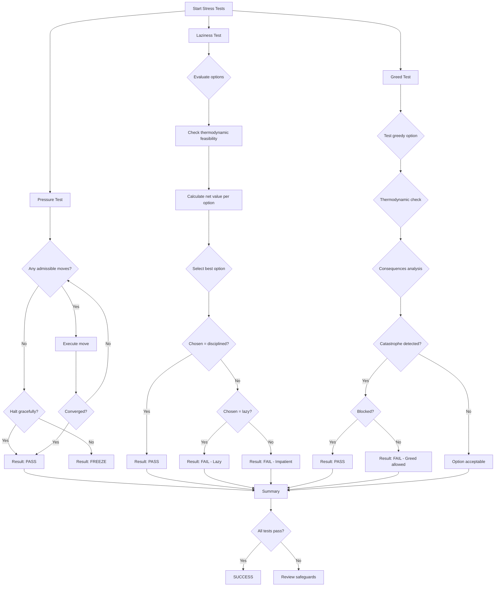

# GMI Stress Test Plan

## Overview

This document outlines three stress tests for the GMI Universal Cognition Engine designed to validate core safety mechanisms:
1. **Pressure Test**: Anti-freeze logic under high constraint environments
2. **Laziness Test**: Discipline/commitment to costly but beneficial paths  
3. **Greed Test**: Ledger blocking of catastrophic long-term decisions

## System Context

### Core Components Analyzed

| Component | File | Purpose |
|-----------|------|---------|
| [`GMIPotential`](core/potential.py:23) | `core/potential.py` | Energy function with budget barrier that diverges as b → 0 |
| [`OplaxVerifier`](ledger/oplax_verifier.py:4) | `ledger/oplax_verifier.py` | Enforces thermodynamic inequality: (V' + σ) ≤ (V + κ) |
| [`Receipt`](ledger/receipt.py:14) | `ledger/receipt.py` | Immutable proof artifact for state transitions |
| [`State`](core/state.py:41) | `core/state.py` | Cognitive state (x, b) coordinates |
| [`HashChainLedger`](ledger/hash_chain.py) | `ledger/hash_chain.py` | Cryptographic ledger for decision records |

### Key Constraints

1. **Budget Barrier**: `V_budget(b) = λ_budget * (scale / b)` → ∞ as b → 0
2. **Thermodynamic Inequality**: `(V(x') + σ) ≤ (V(x) + κ)`
3. **Metabolic Honesty**: σ ≥ 0, cannot undercharge for work
4. **Defect Monotonicity**: κ ≥ 0, accumulated debt must be non-negative

---

## Test 1: Pressure Test (Anti-Freeze Logic)

### Objective
Push the system into high constraint environments and verify it doesn't freeze.

### Hypothesis
When budget (b) approaches zero, the budget barrier diverges to infinity. The system should either:
- Select low-sigma moves that remain admissible
- Halt gracefully when no admissible moves exist
- **FAIL**: Enter infinite loop with no progress

### Test Scenario

```python
# Scenario parameters
initial_budget = 0.5  # Near barrier
instructions = [
    ("TINY_MOVE", sigma=0.1, kappa=0.1),
    ("SMALL_MOVE", sigma=0.3, kappa=0.2),  
    ("MEDIUM_MOVE", sigma=0.6, kappa=0.3),
    ("LARGE_MOVE", sigma=1.0, kappa=0.5),  # Will fail: sigma > budget
]
```

### Verification Criteria

| Condition | Expected Result |
|-----------|-----------------|
| b ≤ 0.1 and no moves admissible | System halts gracefully |
| At least one admissible move exists | System makes progress |
| Steps taken > 0 with low budget | Anti-freeze working |

### Implementation Steps

1. Create State with budget=0.5
2. Iterate through available instructions
3. Track: successful_moves, rejected_moves, freeze_events
4. **PASS**: If system makes progress OR halts gracefully
5. **FAIL**: If system enters infinite loop

---

## Test 2: Laziness Test (Discipline)

### Objective
Give the system a costly but beneficial path and verify it commits.

### Hypothesis
The system should prefer high-cost, high-benefit options over low-cost, low-benefit "lazy" paths. This tests whether the system can "delay gratification" and invest upfront for long-term gain.

### Test Scenario

```python
# Three options presented to system

# LAZY path: Low sigma, tiny improvement
lazy_instr = Instruction(
    "LAZY_STEP", 
    transform=lambda x: x * 0.98,  # 2% improvement
    sigma=0.1,
    expected_steps_to_goal=100
)

# DISCIPLINED path: High sigma, big payoff  
disciplined_instr = Instruction(
    "DISCIPLINED_LEAP",
    transform=lambda x: x * 0.5,   # 50% improvement
    sigma=3.0,
    expected_steps_to_goal=1
)

# IMPATIENT path: Medium sigma, medium reward
impatient_instr = Instruction(
    "IMPATIENT_STEP", 
    transform=lambda x: x * 0.7,
    sigma=1.0,
    expected_steps_to_goal=5
)
```

### Verification Criteria

| Condition | Expected Result |
|-----------|-----------------|
| Disciplined option available and admissible | System should select it |
| System chooses disciplined (fewest steps) | **PASS**: Discipline demonstrated |
| System chooses lazy (most steps) | **FAIL**: Laziness detected |
| System chooses impatient | Partial failure |

### Decision Logic

The system should evaluate each option by:
1. Thermodynamic feasibility: `(V' + σ) ≤ (V + κ)`
2. Expected total cost to goal: `σ * expected_steps`
3. Net value created: `V_before - V_after - σ`

The disciplined path should win because:
- `V_before = 50`, `V_after = 25`, `σ = 3.0`
- Net value: `50 - 25 - 3 = 22` (best per-step value)
- Total cost to goal: `3.0 * 1 = 3` (lowest)

---

## Test 3: Greed Test (Ledger Blocking)

### Objective
Create a path with large short-term reward but catastrophic long-term cost. Verify the ledger blocks it.

### Hypothesis
The thermodynamic inequality might allow a greedy move (if it passes `(V' + σ) ≤ (V + κ)`), but the ledger should recognize and block catastrophically bad long-term decisions.

### Test Scenario

```python
# GREEDY option: Looks great short-term, catastrophic long-term
greedy_instr = Instruction(
    "GREEDY_LEAP",
    transform=lambda x: x * 0.1,  # 90% V reduction!
    sigma=4.5,  # Almost all budget
    kappa=0.0
)

# SAFE option: Moderate improvement, sustainable
safe_instr = Instruction(
    "SAFE_STEP",
    transform=lambda x: x * 0.7,
    sigma=0.5,
    kappa=0.1
)
```

### Catastrophe Analysis

| Check | Catastrophe Trigger |
|-------|---------------------|
| Budget sustainability | `b_prime < 0.5` |
| Potential divergence | `V > 10.0 AND b < 2.0` |
| Ledger integrity | Chain hash mismatch |

### Verification Criteria

| Condition | Expected Result |
|-----------|-----------------|
| Greedy passes thermodynamic check | Could happen (V looks good) |
| Greedy has catastrophic consequences | Ledger should flag/block |
| Safe option selected | **PASS**: Greed test passed |
| Greedy selected with catastrophe | **FAIL**: Greed not blocked |

---

## Mermaid: Test Execution Flow



---

## Implementation Notes

### File Location
`experiments/stress_tests.py`

### Dependencies
- `core.state.State`, `Instruction`, `CompositeInstruction`
- `core.potential.GMIPotential`, `create_potential`
- `ledger.oplax_verifier.OplaxVerifier`
- `ledger.receipt.Receipt`
- `ledger.hash_chain.HashChainLedger`

### Expected Outcomes

| Test | Expected Current Behavior | Desired Behavior |
|------|---------------------------|------------------|
| Pressure | May freeze with low budget | Should select admissible moves or halt |
| Laziness | May choose lazy path | Should choose disciplined path |
| Greed | May allow greedy | Should block catastrophic decisions |

### Failure Modes to Detect

1. **Freeze**: Infinite loop when b approaches 0
2. **Lazy**: System avoids upfront investment  
3. **Greed**: System selects short-term gain over long-term viability

---

## Plan Execution

The tests should be implemented as standalone Python scripts that:
1. Can be run independently or as a suite
2. Output clear pass/fail results with explanations
3. Demonstrate the pathological behavior clearly
4. Verify that core constraints hold

Once this plan is approved, implementation should proceed in **Code mode**.
