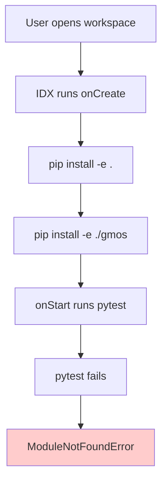
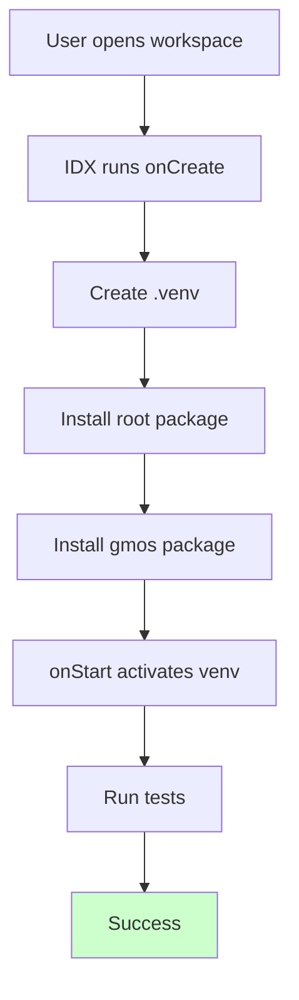

# Monorepo Package Structure Redesign Plan

## Executive Summary

This document analyzes the current dual-package structure conflict in the repository and provides a comprehensive redesign plan to eliminate `ModuleNotFoundError` and test discovery failures.

---

## 1. Current State Analysis

### 1.1 Existing Package Structure

The repository contains **two separate Python packages** in a single monorepo:

| Package | Location | Layout | Purpose |
|---------|----------|--------|---------|
| **gmi** (root) | `/` | Flat | Legacy prototype (archive-only) |
| **gmos** | `gmos/` | Src-layout | Canonical implementation |

### 1.2 Root Package (gmi)

**Location:** Root directory `/`

**Configuration:**
- [`pyproject.toml`](pyproject.toml) defines packages: `core`, `memory`, `ledger`, `runtime`, `adapters`
- Uses flat layout (no `src/` directory)
- Version: `0.1.0`
- Marked as **ARCHIVE-ONLY** per [`CANONICAL.md`](CANONICAL.md)

**Test Configuration:**
```toml
[tool.pytest.ini_options]
testpaths = ["tests"]
norecursedirs = ["gmos", "experiments", "adapters"]
```

### 1.3 GM-OS Package (gmos)

**Location:** `gmos/`

**Configuration:**
- [`gmos/pyproject.toml`](gmos/pyproject.toml) with `package-dir = {"" = "src"}`
- Uses src-layout: `gmos/src/gmos/...`
- Version: `0.2.0`
- **Canonical implementation** - all new development happens here

**Test Configuration:**
```toml
[tool.pytest.ini_options]
testpaths = ["tests"]
```

### 1.4 Current `.idx/dev.nix` Configuration

```nix
workspace = {
  onCreate = {
    install-deps = "pip install -e .[dev]";
    gmos-install = "(cd gmos && pip install -e .[dev])";
  };
  onStart = {
    run-tests = "pytest && (cd gmos && pytest)";
  };
};
```

---

## 2. Problem Diagnosis

### 2.1 Why the Setup is Breaking

1. **Dual-Install Complexity**: Both packages must be installed in editable mode (`-e .` and `-e ./gmos`) for imports to work correctly. If only one is installed, imports for the other fail.

2. **IDE/Environment Resolution**: VS Code, Project IDX, and other tools may only detect one Python interpreter, making the second package invisible to the language server.

3. **Test Discovery Conflicts**: 
   - Root `pytest` excludes `gmos` via `norecursedirs`
   - Running `pytest` inside `gmos/` requires the gmos package to be installed
   - No unified test runner for both packages

4. **Nix Environment Limitations**: The Project IDX `.idx/dev.nix` runs pip install commands, but:
   - No virtual environment is created
   - Package installation happens on workspace creation but may fail silently
   - Python path may not persist correctly between sessions

### 2.2 Import Conflict Scenarios

| Scenario | Root gmi installed | GM-OS installed | Result |
|----------|---------------------|-----------------|--------|
| 1 | ✅ | ❌ | `import gmos` fails |
| 2 | ❌ | ✅ | `import core` fails (but core is archive-only anyway) |
| 3 | ✅ | ✅ | Both work (but requires dual-install) |

---

## 3. Alternative Designs

### Option A: Keep Dual-Package with Improved Setup (Recommended)

**Concept:** Maintain the current structure but fix the installation and IDE configuration issues.

**Pros:**
- No code reorganization required
- Respects the CANONICAL.md decision (GM-OS is canonical)
- Clear separation between legacy (archive) and canonical code

**Cons:**
- Requires careful setup documentation
- Dual-install must be remembered in CI/IDX

### Option B: Single Package (Merge gmos into root)

**Concept:** Move `gmos/src/gmos/*` to root level and eliminate the `gmos/` subdirectory.

```
/ (root)
├── src/
│   └── gmos/           # Current gmos/src/gmos/
├── core/               # Archive only
├── memory/             # Archive only
└── pyproject.toml      # Single package definition
```

**Pros:**
- Single installation (`pip install -e .`)
- Simpler for IDEs and test runners
- No dual-package confusion

**Cons:**
- Major refactoring required
- Breaks existing import paths for contributors
- Loses clean separation between canonical and legacy code
- Requires updating all import statements

### Option C: Single Package with Namespace (Advanced)

**Concept:** Use namespace packages to merge both packages into one unified namespace.

**Pros:**
- Single installation
- Preserves existing import paths

**Cons:**
- Complex setuptools configuration
- Easy to get wrong
- Namespace package pitfalls

---

## 4. Recommended Approach: Option A

Given that:
1. [`CANONICAL.md`](CANONICAL.md) explicitly designates GM-OS as canonical
2. Legacy directories are marked as archive-only
3. The dual-package structure is already documented

**Option A** is recommended because:
- Minimal disruption to existing code
- Preserves the architectural decision
- Fixes are primarily in configuration, not code

---

## 5. Implementation Plan

### Phase 1: Fix IDE/Environment Configuration

#### 1.1 Update `.idx/dev.nix` with Virtual Environment

```nix
workspace = {
  onCreate = {
    # Create virtual environment
    setup-venv = ''
      python -m venv .venv
      .venv/bin/pip install --upgrade pip
      .venv/bin/pip install -e .
      .venv/bin/pip install -e ./gmos
    '';
  };
  onStart = {
    # Activate venv and run tests
    activate-and-test = ''
      source .venv/bin/activate
      pytest tests/ && cd gmos && pytest tests/
    '';
  };
};
```

#### 1.2 Update Root `pyproject.toml`

Add explicit pytest configuration to handle both test directories:

```toml
[tool.pytest.ini_options]
testpaths = ["tests", "gmos/tests"]
python_files = ["test_*.py"]
python_functions = ["test_*"]
```

### Phase 2: Create Setup Documentation

Create a `SETUP.md` file documenting the dual-install requirement:

```markdown
# Development Setup

## Quick Start

```bash
# Create virtual environment
python -m venv .venv
source .venv/bin/activate

# Install both packages
pip install -e .
pip install -e ./gmos

# Run tests
pytest tests/          # Legacy tests
cd gmos && pytest      # GM-OS tests
```

### Phase 3: Add CI Configuration

Create `.github/workflows/test.yml`:

```yaml
name: Tests

on: [push, pull_request]

jobs:
  test:
    runs-on: ubuntu-latest
    steps:
      - uses: actions/checkout@v4
      - name: Set up Python
        uses: actions/setup-python@v5
        with:
          python-version: '3.11'
      - name: Create venv
        run: python -m venv .venv
      - name: Install packages
        run: |
          .venv/bin/pip install -e .
          .venv/bin/pip install -e ./gmos
      - name: Run root tests
        run: .venv/bin/pytest tests/
      - name: Run GM-OS tests
        run: |
          cd gmos
          ../.venv/bin/pytest tests/
```

---

## 6. Mermaid Diagram: Current vs Proposed Flow

### Current (Broken) Flow



### Proposed (Fixed) Flow



---

## 7. Action Items

- [ ] **Priority 1:** Update `.idx/dev.nix` to create virtual environment and install both packages
- [ ] **Priority 2:** Update root `pytest.ini_options` to include both test paths
- [ ] **Priority 3:** Create `SETUP.md` with dual-install instructions
- [ ] **Priority 4:** Add GitHub Actions workflow for CI
- [ ] **Priority 5:** Test the fix in Project IDX environment

---

## 8. Files to Modify

| File | Change Type | Description |
|------|-------------|-------------|
| `.idx/dev.nix` | Modify | Add venv creation and proper activation |
| `pyproject.toml` | Modify | Update pytest config for dual test paths |
| `SETUP.md` | Create | Document dual-install requirement |
| `.github/workflows/test.yml` | Create | CI configuration |

---

## 9. Success Criteria

After implementation:
1. Running `pytest` in root discovers tests in both `tests/` and `gmos/tests/`
2. `import gmos` works from any directory after activating the venv
3. Project IDX environment starts without errors
4. IDE (VS Code/IDX) shows no import errors for either package
