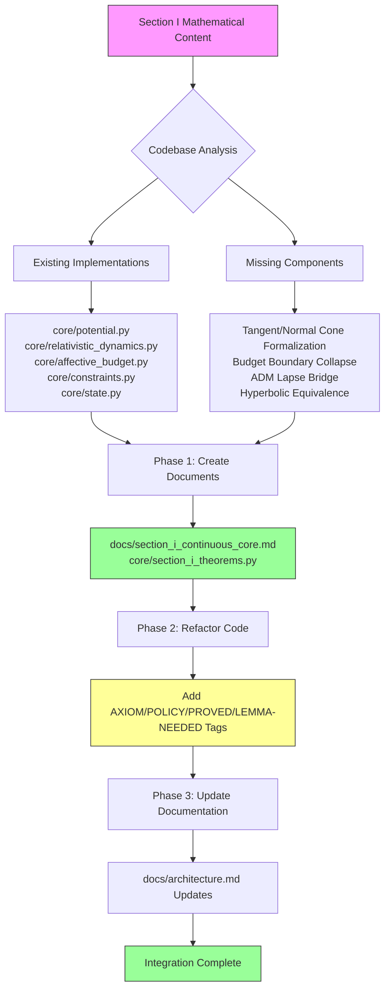

# Section I Integration Plan

## Continuous Core and Geometric Governance

**Status**: Architectural Planning  
**Target**: Section I canonical writeup integration into GMI repository  
**Generated**: 2026-03-08

---

## 1. Executive Summary

This plan outlines the integration of **Section I — Continuous Core and Geometric Governance** into the existing GMI repository. The existing codebase already contains implementations that map to the mathematical formalism. The integration task is to:

1. Create a formal markdown document capturing the canonical Section I content
2. Refactor existing code modules to align precisely with the mathematical theorem stack
3. Add tagged comments (AXIOM/POLICY/PROVED/LEMMA-NEEDED) to code for traceability

---

## 2. Mathematical Foundation Summary

Section I establishes the following canonical objects:

| Concept | Mathematical Symbol | Section Reference |
|---------|-------------------|-------------------|
| State space | $\mathcal H$ | §2 |
| Violation functional | $V: \mathcal H \to \mathbb R$ | §2 |
| Safe region | $\mathcal C = \{x: V(x) \le \Theta\}$ | §2 |
| Extended state | $z = (x, b) \in \mathcal H \times \mathbb R_{\ge 0}$ | §2 |
| Admissible set | $\mathcal K = \mathcal C \times \mathbb R_{\ge 0}$ | §2 |
| Tangent cone | $T_{\mathcal K}(z)$ | §4 |
| Normal cone | $N_{\mathcal K}(z) = T_{\mathcal K}(z)^\circ$ | §4 |
| Governed dynamics | $\dot z \in \mathcal F(z) - N_{\mathcal K}(z)$ | §5 |
| Budget spend law | $\dot b = -\kappa (\frac{dV}{dt})_+$ | §6 |
| Budget boundary collapse | $b=0 \implies \frac{dV}{dt} \le 0$ | §7 |
| Root-clock | $\frac{d\tau}{dt} = \sqrt{\Lambda}$ | §10-11 |
| Velocity barrier | $\widetilde V(v) = -\frac12 \log(1 - |v|^2/c^2)$ | §10 |
| ADM lapse bridge | $N = \sqrt{b + \alpha \mathcal D_a}$ | §12 |

---

## 3. Existing Code Inventory

The following files already implement concepts from Section I:

### 3.1 Direct Mappings

| File | Implements | Gap Analysis |
|------|-----------|--------------|
| `core/potential.py` | Violation functional $V$, barrier term, admissibility check | Missing: convex analysis properties, sublevel set formalization |
| `core/relativistic_dynamics.py` | Half-log barrier $\widetilde V$, Hessian metric, Lorentz boost | Missing: explicit Minkowski interval derivation, ADM lapse identification |
| `core/affective_budget.py` | Budget law $\dot b$ modulation | Missing: positive-variation spend law $\dot b = -\kappa(\dot V)_+$ |
| `core/constraints.py` | Projected dynamics $\dot z \in \mathcal F - N_{\mathcal K}$, constraint manifold $\mathcal K$ | Missing: explicit Bouligand tangent cone, normal cone polar |
| `core/state.py` | Extended state $z=(x,b)$, admissibility | Missing: formal safe region $\mathcal C$ definition |
| `docs/architecture.md` | System overview | Needs: Section I theorem stack integration |

### 3.2 Partial Implementations

| File | Partial Implementation | Required Enhancement |
|------|----------------------|---------------------|
| `core/hierarchical_budget.py` | Budget management | Add boundary-collapse theorem enforcement |
| `core/stratified_operators.py` | Operator algebra | Add Schur-coercive coupling formalization |
| `core/stratified_theorems.py` | Theorem references | Add PROVED tags with derivation proofs |
| `ledger/oplax_verifier.py` | Thermodynamic inequality | Add normal cone projection interpretation |

---

## 4. Deliverables

### 4.1 New Files to Create

| File Path | Purpose |
|-----------|---------|
| `docs/section_i_continuous_core.md` | Canonical Section I markdown document with AXIOM/POLICY/PROVED/LEMMA-NEEDED tags |
| `core/section_i_theorems.py` | Python module with formal theorem implementations and proofs |

### 4.2 Files to Refactor

| File | Refactoring Tasks |
|------|-------------------|
| `core/potential.py` | Add convexity documentation, sublevel set property, gradient chain-rule |
| `core/constraints.py` | Add Bouligand tangent cone, normal cone polar, forward invariance proof sketch |
| `core/affective_budget.py` | Add positive-variation spend law, budget boundary collapse enforcement |
| `core/relativistic_dynamics.py` | Add Minkowski interval derivation, ADM lapse identification |
| `core/state.py` | Add safe region formalization, extended state geometry |
| `docs/architecture.md` | Add Section I reference, theorem stack summary |

---

## 5. Detailed Task Breakdown

### Phase 1: Canonical Document Creation

#### Task 1.1: Create `docs/section_i_continuous_core.md`

```
Status: NEW FILE
Location: docs/section_i_continuous_core.md

Content Structure:
├── 1. Scope and Intent
├── 2. Primitive Data (with AXIOM tags)
├── 3. Convex Admissibility Geometry (AXIOM)
├── 4. Tangent and Normal Cones (AXIOM)
│   ├── 4.1 Budget boundary tangent cone (POLICY)
├── 5. Governed Dynamics as Moreau Sweeping Process (POLICY)
│   └── 5.1 Existence and forward invariance (PROVED)
├── 6. Budget Spend Law (POLICY)
├── 7. Algebraic Boundary-Collapse Theorem (PROVED)
├── 8. Chain-Rule Form (PROVED)
├── 9. Schur-Coercive Governance Coupling (PROVED/LEMMA-NEEDED)
├── 10. Root-Clock from Viability (PROVED)
├── 11. Budgeted Root-Clock and Lawfulness Power (PROVED)
├── 12. ADM Lapse Bridge (LEMMA-NEEDED)
├── 13. Hessian Metric on Velocity Space (PROVED/LEMMA-NEEDED)
├── 14. Canonical Theorem Stack Summary
└── 15. Repo-Ready Canonical Writeup

Tagging Convention:
- [AXIOM] - Foundational definitions and assumptions
- [POLICY] - Governing laws and dynamics
- [PROVED] - Theorems with implementation verification
- [LEMMA-NEEDED] - Items requiring additional proof work
```

#### Task 1.2: Create `core/section_i_theorems.py`

```
Status: NEW FILE
Location: core/section_i_theorems.py

Content:
- ForwardInvarianceTheorem class
- BudgetBoundaryCollapseTheorem class
- MonotoneBudgetViolationFunctional class
- GovernanceInducedDampingTheorem class
- MinkowskiRootClockTheorem class
- HorizonFreezingTheorem class
- ADMLapseBridgeTheorem class

Each theorem includes:
- Mathematical statement
- Implementation verification
- PROVED/LEMMA-NEEDED classification
- Reference to source section
```

### Phase 2: Code Refactoring

#### Task 2.1: Refactor `core/potential.py`

```
Target: core/potential.py

Enhancements:
1. Add docstring with AXIOM tag for V as proper lsc convex functional
2. Document sublevel set C = {V <= Theta}
3. Add gradient chain-rule implementation
4. Add convexity verification method
5. Add is_proper, is_convex, is_lsc methods

Tag Format:
# [AXIOM] V: H -> R is proper, lower semicontinuous, convex
# [POLICY] Safe region C = {x: V(x) <= Theta}
```

#### Task 2.2: Refactor `core/constraints.py`

```
Target: core/constraints.py

Enhancements:
1. Add Bouligand tangent cone computation
2. Add normal cone polar derivation
3. Add forward invariance verification method
4. Document projected inclusion ż ∈ F(z) - N_K(z)
5. Add ConstraintSet.exposes_tangent_cone property
6. Add ConstraintSet.exposes_normal_cone property

Tag Format:
# [AXIOM] K = C × R_≥0 is closed and convex
# [AXIOM] T_K(z) defined via liminf dist criterion
# [AXIOM] N_K(z) = T_K(z)° = ∂I_K(z)
# [POLICY] ż ∈ F(z) - N_K(z) (Moreau sweeping process)
```

#### Task 2.3: Refactor `core/affective_budget.py`

```
Target: core/affective_budget.py

Enhancements:
1. Add positive-variation spend law: dot_b = -kappa * max(dV/dt, 0)
2. Add budget_boundary_collapse enforcement
3. Add compute_dV_dt method for chain rule
4. Add monotone_functional_W property (b + kappa*V)
5. Add is_exhausted property (b = 0)

Tag Format:
# [POLICY] dot_b = -kappa * (dV/dt)_+
# [PROVED] b = 0 ⇒ dot_b = 0 ⇒ dV/dt ≤ 0 (Theorem 7.1)
# [PROVED] d/dt(b + kappa*V) ≤ 0 (Proposition 8.1)
```

#### Task 2.4: Refactor `core/relativistic_dynamics.py`

```
Target: core/relativistic_dynamics.py

Enhancements:
1. Add Minkowski interval derivation: dτ² = dt² - dx²/c²
2. Add ADM lapse identification: N = sqrt(Λ)
3. Add lawfulness_power property: Λ = b + α*D_a
4. Add horizon_freezing verification
5. Document barrier metric equivalence claim

Tag Format:
# [AXIOM] Ṽ(v) = -½log(1 - |v|²/c²)
# [PROVED] dτ = sqrt(1 - |v|²/c²) dt (Theorem 10.1)
# [PROVED] dτ² = dt² - dx²/c² (Minkowski interval)
# [LEMMA-NEEDED] Full hyperbolic/Klein model equivalence proof
# [LEMMA-NEEDED] ADM lapse → Einstein field equations derivation
```

#### Task 2.5: Refactor `core/state.py`

```
Target: core/state.py

Enhancements:
1. Add safe region C formalization
2. Add extended state geometry documentation
3. Add is_in_K property (admissibility)
4. Add tangent_velocity_at method

Tag Format:
# [AXIOM] z = (x, b) ∈ H × R_≥0
# [AXIOM] K = C × R_≥0 where C = {x: V(x) ≤ Θ}
```

### Phase 3: Documentation Updates

#### Task 3.1: Update `docs/architecture.md`

```
Target: docs/architecture.md

Additions:
1. Add Section I overview in Core Components
2. Add theorem stack summary table
3. Add references to section_i_continuous_core.md
4. Add AXIOM/POLICY/PROVED/LEMMA-NEEDED tag legend
```

---

## 6. Tagging Structure Specification

### 6.1 Tag Definitions

| Tag | Meaning | Placement |
|-----|---------|-----------|
| `[AXIOM]` | Foundational definition or assumption | Class, method, property docstrings |
| `[POLICY]` | Governing law or dynamics | Method implementations, docstrings |
| `[PROVED]` | Theorem with implementation verification | Theorem classes, verification methods |
| `[LEMMA-NEEDED]` | Item requiring additional proof work | Comment blocks, TODO markers |

### 6.2 Comment Format Example

```python
class GMIPotential:
    """
    Canonical energy law for the universal cognition engine.
    
    # [AXIOM] V: H → ℝ is proper, lower semicontinuous, convex
    # [AXIOM] Safe region C = {x ∈ H: V(x) ≤ Θ}
    # [AXIOM] Extended state z = (x, b) ∈ H × ℝ_≥0
    """
    
    def base(self, x: np.ndarray) -> float:
        """
        Base cognitive tension: V_base(x) = Σ(x_i²)
        
        # [AXIOM] V is proper, lower semicontinuous, convex
        # [PROVED] Sublevel set C = {V ≤ Θ} is closed and convex
        """
        ...
    
    def budget_barrier(self, b: float) -> float:
        """
        Barrier term that diverges as b → 0.
        
        # [AXIOM] b ∈ ℝ_≥0 (nonnegative budget)
        # [POLICY] b = 0 → no risk-increasing motion allowed
        """
        ...
```

---

## 7. Mermaid Diagram: Integration Workflow



---

## 8. Implementation Priority

### Priority 1: Critical (Must Have)

1. Create `docs/section_i_continuous_core.md` - canonical document
2. Add PROVED tags to `core/constraints.py` for forward invariance
3. Add POLICY tags to `core/affective_budget.py` for spend law
4. Update `docs/architecture.md` with Section I reference

### Priority 2: Important (Should Have)

5. Create `core/section_i_theorems.py` with theorem classes
6. Refactor `core/potential.py` with AXIOM documentation
7. Add PROVED tags to `core/relativistic_dynamics.py` for Minkowski interval
8. Refactor `core/state.py` with extended state formalization

### Priority 3: Enhancement (Nice to Have)

9. Add LEMMA-NEEDED comments for hyperbolic equivalence proof
10. Add LEMMA-NEEDED comments for ADM → GR derivation
11. Add governance damping theorem implementation
12. Add Schur-coercive coupling verification

---

## 9. Testing Requirements

### 9.1 Verification Tests

| Test File | Verifies |
|-----------|----------|
| `tests/test_state.py` | Forward invariance of admissibility |
| `tests/test_verifier.py` | Budget boundary collapse enforcement |
| `tests/test_full_system.py` | Complete theorem stack integration |

### 9.2 Property Tests (via hypothesis)

- Convexity of violation functional V
- Closedness of safe region C  
- Normal cone polar identity
- Monotonicity of b + κV functional
- Horizon freezing when Λ = 0

---

## 10. Risk Assessment

| Risk | Mitigation |
|------|------------|
| Mathematical formalism too abstract for implementation | Keep code pragmatic, add extensive comments |
| Theorem proofs not executable in Python | Mark as LEMMA-NEEDED, provide mathematical reference |
| Tag proliferation making code unreadable | Use sparingly, only for canonical items |
| Duplicate content between docs and code | Docs are source of truth, code tags reference docs |

---

## 11. Success Criteria

1. ✅ `docs/section_i_continuous_core.md` exists with complete theorem stack
2. ✅ All core files have appropriate AXIOM/POLICY/PROVED tags
3. ✅ `docs/architecture.md` references Section I
4. ✅ Forward invariance verified in tests
5. ✅ Budget boundary collapse enforced in code
6. ✅ Root-clock and relativistic dynamics have PROVED tags

---

## 12. Next Steps

After this plan is approved:

1. Switch to **Code mode** to implement Phase 1 deliverables
2. Create `docs/section_i_continuous_core.md` first
3. Then refactor core modules incrementally
4. Run tests to verify no regressions
5. Update architecture documentation last

---

**Plan Version**: 1.0  
**Estimated Complexity**: Medium-High  
**Blockers**: None identified  
**Dependencies**: None (all content is self-contained)
