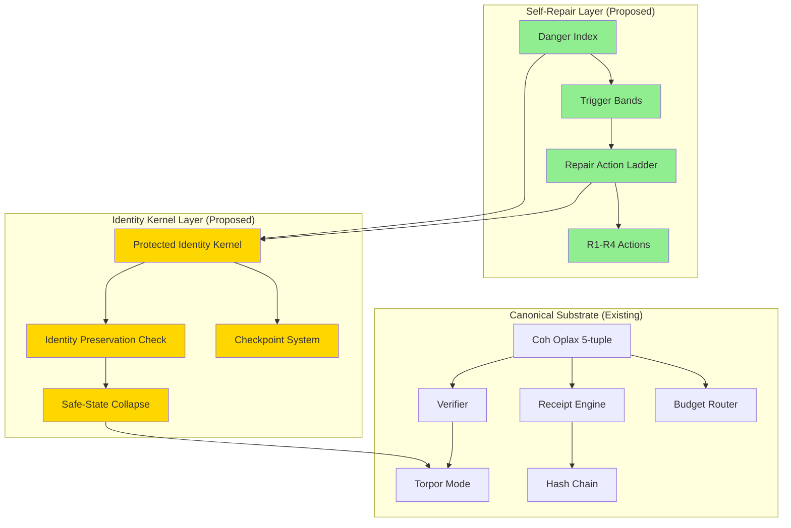
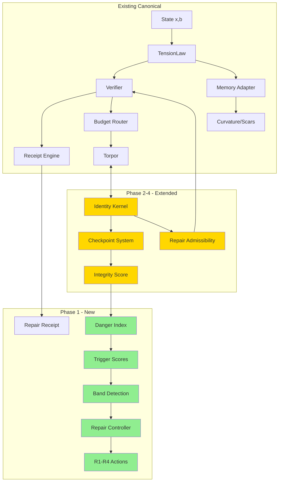
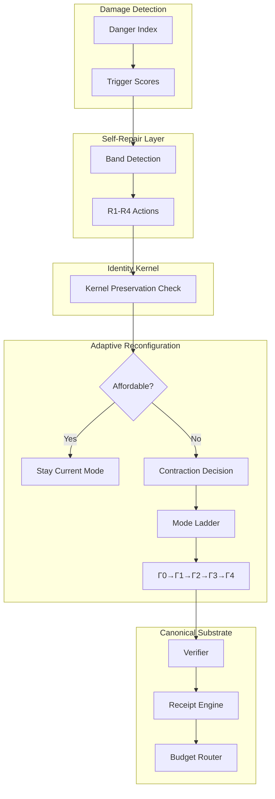

# Self-Repair Model + Protected Identity Kernel Implementation Plan

## Executive Summary

This document maps **both** the Self-Repair Model and the Protected Identity Kernel Model to the existing GM-OS codebase, identifies canonical components already implemented, and details the proposed extensions that require new implementation.

**Status**: The canonical substrate (Coh oplax, PhaseLoom memory, viability dynamics, receipt verification, torpor) is already substantially implemented. The self-repair and identity kernel models are proposed as extension layers on top.

---

## Unified Architecture

The Self-Repair Model and Identity Kernel form a unified self-healing architecture:



---

## Part I: Canonical Substrate Analysis

### 1.1 Already Implemented (Source-Backed)

| Model Component | Canonical Location | Implementation Status |
|-----------------|-------------------|----------------------|
| **Coh oplax 5-tuple** | `gmos/kernel/verifier.py` | ✅ Implemented - `State`, `CompositeInstruction`, `Proposal`, `Receipt` classes with soundness law |
| **Extended admissible set K** | `gmos/kernel/continuous_dynamics.py` | ✅ Implemented - `AdmissibleSet` class with reserve floors, potential thresholds |
| **PhaseLoom memory coordinates** | `gmos/agents/gmi/state.py`, `gmos/memory/workspace.py` | ✅ Implemented - `curvature`, `tension` fields, `PhantomState` with curvature |
| **Budget dynamics** | `gmos/kernel/budget_router.py`, `gmos/kernel/verifier.py` | ✅ Implemented - reserve law enforcement, spend/defect |
| **Tension law** | `gmos/agents/gmi/tension_law.py` | ✅ Implemented - `GMITensionLaw` with residual components (obs, mem, goal, cons, plan, act, meta) |
| **Curvature/scar mechanics** | `gmos/agents/gmi/memory_adapter.py`, `gmos/agents/gmi/evolution_loop.py` | ✅ Implemented - `write_scar()`, `read_curvature()`, scar-based potential |
| **Receipt verification** | `gmos/kernel/gmi_receipts.py`, `gmos/kernel/receipt_engine.py` | ✅ Implemented - `RepairReceipt`, receipt chain validation |
| **Torpor mode** | `gmos/kernel/scheduler.py`, `gmos/agents/gmi/hosted_agent.py` | ✅ Implemented - torpor entry/exit, wake conditions |
| **Continuous dynamics** | `gmos/kernel/continuous_dynamics.py` | ✅ Implemented - Moreau-projected dynamics, normal cone projection |
| **Repair mode operational** | `gmos/kernel/substrate_state.py` | ✅ Implemented - `OperationalMode.REPAIR` enum value |

### 1.2 Partially Implemented

| Model Component | Current State | Gap |
|-----------------|---------------|-----|
| **Protected identity kernel** | Basic process identity | Missing: formal kernel definition with ID, provenance, policy, seed, reserve continuity |
| **Baseline healthy envelope** | None | Missing: storage of last known lawful state |
| **Checkpoint system** | Episode archival | Missing: formal checkpoint anchors with reconstruction policy |
| **Integrity trigger (H)** | Chain integrity checks | Missing: formal integrity score computation |
| **Identity trigger (I)** | None | Missing: identity coherence metric |

---

## Part II: Model-to-Code Mapping

### Section 0-2: State Model

| Model Notation | Code Location | Field/Class |
|---------------|---------------|-------------|
| `x ∈ X` | `gmos/agents/gmi/state.py` | `State.x` |
| `b ∈ B` | `gmos/agents/gmi/state.py` | `State.b` |
| `C_p` (curvature) | `gmos/agents/gmi/state.py` | `State.curvature` |
| `T_p` (tension) | `gmos/agents/gmi/tension_law.py` | `ResidualVector` + `GMITensionLaw.compute()` |
| `H_p` (integrity) | `gmos/kernel/hash_chain.py` | Chain verification |
| `k_p` (identity kernel) | **MISSING** | Needs new implementation |

### Section 3-6: Observables & Triggers

| Model Notation | Proposed Implementation | Priority |
|---------------|------------------------|----------|
| `V_p` (risk) | `tension_law.py` - tension computation | ✅ Done |
| `T_p` (tension) | `tension_law.py` - residual magnitudes | ✅ Done |
| `C_p` (curvature) | `memory_adapter.py` - scar accumulation | ✅ Done |
| `B_p` (budget) | `budget_router.py` - current allocation | ✅ Done |
| `H_p` (integrity) | `hash_chain.py` - chain continuity | ⚠️ Partial |
| `I_p` (identity) | **NEW** - identity coherence metric | 🔲 New |
| `D_p` (danger index) | **NEW** - coupled danger functional | 🔲 New |
| `Θ_*` (triggers) | **NEW** - normalized thresholds | 🔲 New |

### Section 7-9: Repair Action Ladder

| Band | Model Behavior | Current Implementation | Gap |
|------|---------------|----------------------|-----|
| Band 0 (Healthy) | No action | N/A | ✅ N/A |
| Band 1 (Drift) | Local correction | `memory_adapter.py` - cache refresh | ⚠️ Implicit |
| Band 2 (Damage) | Targeted repair | `evolution_loop.py` - scar/prune | ⚠️ Implicit |
| Band 3 (Critical) | Structural contraction | **MISSING** - needs explicit logic | 🔲 New |
| Band 4 (Collapse) | Safe-state collapse | `torpor` mode exists | ⚠️ Needs kernel integration |

### Section 10: Protected Identity Kernel

The protected identity kernel is **not explicitly implemented**. Required components:

```
K^id_p = (ID_p, Ω_p, Π_p, Σ_p, Λ_p, A_p)
```

| Component | Description | Proposed Location |
|-----------|-------------|-------------------|
| `ID_p` | Process identity anchor | `kernel/process_table.py` |
| `Ω_p` | Provenance ledger anchor | `kernel/hash_chain.py` |
| `Π_p` | Collapse/reconstruction policy | **NEW** - kernel module |
| `Σ_p` | Minimal reconstruction seed | **NEW** - memory checkpoint |
| `Λ_p` | Budget reserve continuity | `kernel/budget_router.py` |
| `A_p` | Admissibility shell | `kernel/verifier.py` |

### Section 11-13: Physics Layers

| Physics | Model | Code Implementation | Status |
|---------|-------|-------------------|--------|
| Continuous | `dot(x)_p ∈ F + N_K + U_repair` | `continuous_dynamics.py` | ✅ Implemented |
| Discrete | `V(x') + Spend ≤ V(x) + Defect` | `verifier.py` | ✅ Implemented |
| Repair | Receipt verification | `gmi_receipts.py` | ✅ Implemented |

---

## Part III: Implementation Roadmap

### Phase 1: Minimal V0.1 (Four-Signal Immune System)

Per Section 18 of the model: *For v0.1, a practical implementation only needs four signals: (V, T, B, H)*

```
✅ V (risk)          → tension_law.py (existing)
✅ T (tension)       → tension_law.py (existing)
✅ B (budget)        → budget_router.py (existing)
⚠️ H (integrity)     → hash_chain.py (partial)
🔲 Danger functional → NEW
🔲 Trigger bands     → NEW
🔲 Band-based actions → NEW
```

#### Phase 1 Tasks

1. **Create danger functional module** (`gmos/src/gmos/kernel/danger.py`)
   - Implement `DangerIndex` class with weighted sum of triggers
   - Normalize trigger scores: `Θ_V, Θ_T, Θ_B, Θ_H`
   - Implement persistence filter: `P_θ(t)` integral/discrete

2. **Create repair controller module** (`gmos/src/gmos/kernel/repair_controller.py`)
   - Implement 5-band threshold detection
   - Implement action ladder (R1-R4)
   - Integrate with scheduler for band-based mode switching

3. **Enhance integrity tracking** (`gmos/kernel/hash_chain.py`)
   - Add integrity score `H_p` computation
   - Track checkpoint availability
   - Add provenance continuity metrics

### Phase 2: Full State Model (V, T, C, B, H, I)

Per Section 4: *The process tracks repair observable vector R_p(t) = (V_p, T_p, C_p, B_p, H_p, I_p)*

#### Phase 2 Tasks

1. **Add identity coherence (I)** - New module
   - Define identity deformation metric
   - Track distance from protected kernel
   - Implement identity trigger `Θ_I`

2. **Add curvature tracking (C)** - Enhance existing
   - Already in `state.py` and `memory_adapter.py`
   - Add scar accumulation monitoring
   - Add curvature trigger `Θ_C`

3. **Protected identity kernel** - New module
   - Define `IdentityKernel` dataclass
   - Implement kernel preservation check
   - Add collapse-safe reconstruction logic

### Phase 3: Thermodynamic & Continuous Physics

Per Sections 11-14: *Continuous repair physics, dissipation inequality, repair admissibility lemma*

#### Phase 3 Tasks

1. **Continuous repair dynamics**
   - Extend `continuous_dynamics.py` with repair control field
   - Implement dissipation inequality check
   - Add repair efficiency metrics

2. **Repair admissibility lemma**
   - Implement formal verification of repair legality
   - Add `verify_repair_admissibility()` to verifier
   - Track spend/reserve budget during repair

3. **Thermodynamic cost accounting**
   - Track `W_repair` (continuous dissipation)
   - Track `κ_repair` (discrete projection loss)
   - Integrate with receipt system

### Phase 4: Advanced Features

Per Sections 15-17: *Integrity, identity continuity, torpor as terminal repair*

#### Phase 4 Tasks

1. **Checkpoint system**
   - Implement `CheckpointKernel` class
   - Add anchor validity tracking
   - Add schema compatibility checks

2. **Identity continuity physics**
   - Implement bounded deformation metric
   - Add identity preservation verification
   - Ship of Theseus resolution

3. **Enhanced torpor integration**
   - Connect band-4 collapse to torpor
   - Implement minimum-energy regime
   - Add torpor exit conditions

---

## Part IV: File Creation Checklist

### New Files Required

| File | Purpose | Phase |
|------|---------|-------|
| `gmos/src/gmos/kernel/danger.py` | Danger index & trigger computation | 1 |
| `gmos/src/gmos/kernel/repair_controller.py` | Band detection & action ladder | 1 |
| `gmos/src/gmos/kernel/identity_kernel.py` | Protected identity kernel | 2 |
| `gmos/src/gmos/kernel/checkpoint.py` | Checkpoint anchors | 4 |
| `gmos/src/gmos/kernel/repair_verifier.py` | Repair admissibility verification | 3 |

### Existing Files to Modify

| File | Modification | Phase |
|------|--------------|-------|
| `gmos/kernel/hash_chain.py` | Add integrity scoring | 1 |
| `gmos/kernel/verifier.py` | Add repair admissibility check | 3 |
| `gmos/kernel/scheduler.py` | Add band-based mode switching | 1 |
| `gmos/kernel/continuous_dynamics.py` | Add repair control field | 3 |
| `gmos/agents/gmi/state.py` | Add identity fields | 2 |
| `gmos/agents/gmi/tension_law.py` | Add repair mode tension law | 1-2 |

---

## Part V: Test Strategy

### Unit Tests

1. **DangerFunctionalTests**: Verify weighted sum and trigger normalization
2. **RepairControllerTests**: Verify band detection and action selection
3. **IdentityKernelTests**: Verify kernel preservation under deformation
4. **RepairAdmissibilityTests**: Verify soundness law for repair transitions

### Integration Tests

1. **SelfRepairCycleTests**: Full repair cycle from drift to recovery
2. **TorporIntegrationTests**: Band-4 collapse → torpor → wake
3. **CheckpointRecoveryTests**: Identity preservation through collapse

---

## Appendix: Mermaid Diagram - Component Relationships



---

# Part VI: Protected Identity Kernel - Implementation Mapping

(Content remains as previously defined...)

## 1. Formal Definition

The Protected Identity Kernel is defined as the 6-tuple:

```
K^id_P = (ID_P, Ω_P, Π_P, Σ_P, Λ_P, A_P)
```

## 2. Component Mapping

| Kernel Component | Model Definition | Current Implementation | Gap |
|-----------------|------------------|----------------------|-----|
| `ID_P` | `(process_id, genesis_receipt_hash, lineage_root)` | `process_id` in `process_table.py`, genesis in `receipt_engine.py` | Missing: lineage_root, genesis hash tracking |
| `Ω_P` | `(H_n, r*, C*)` - chain digest, checkpoint, ancestry | `hash_chain.py` has chain digest | Missing: checkpoint anchor, ancestry references |
| `Π_P` | `(policy_hash, collapse_profile, repair_profile)` | `substrate_state.py` has `policy_hash` | Missing: collapse/repair profiles |
| `Σ_P` | `(self_seed, goal_seed, semantic_anchors, stable_shell)` | None | 🔲 NEW |
| `Λ_P` | `(B_reserve, B_last, repair_policy, collapse_floor)` | `budget_router.py` has reserves | Missing: repair_policy, collapse_floor tracking |
| `A_P` | `(ε_id, ε_prov, ε_semantic, deformation_constraints)` | None | 🔲 NEW |

## 3. Identity Continuity Law Implementation

| Continuity Condition | Model Equation | Implementation Location |
|---------------------|----------------|------------------------|
| Canonical identity | `ID_P' = ID_P` | `process_table.py` |
| Provenance continuity | `Ω_P → Ω_P'` | `hash_chain.py` + checkpoint |
| Policy continuity | `Π_P' = Π_P` or `~policy` | `substrate_state.py` |
| Kernel deformation | `d_id(K, K') ≤ ε_id` | **NEW** - identity_kernel.py |

## 4. Identity Failure Classes

| Failure Class | Kernel Component | Detection Implementation |
|---------------|------------------|------------------------|
| Soft contraction | None lost | Normal repair path |
| Provenance fracture | `Ω_P` broken | `hash_chain.py` verify failure |
| Policy amnesia | `Π_P` lost | policy_hash mismatch |
| Semantic hollowing | `Σ_P` degraded | **NEW** - seed viability check |
| Metabolic fraud | `Λ_P` violated | reserve check failure |
| Identity death | `ID_P` or `A_P` lost | **NEW** - identity verification |

## 5. Safe-State Collapse Law

Per Section 7-8: R4 collapse preserves kernel:

```
K_P^id ⊆ x_safe
```

Implementation: `identity_kernel.py` → verify kernel preservation before collapse.

## 6. Identity-Preserving Restoration Theorem

**Target theorem**: If kernel preserved and soundness holds, restoration is lawful:

```
V(x') + Spend(r) ≤ V(x) + Defect(r)
```

Implementation: `repair_verifier.py` + `identity_kernel.py`

---

# Part VII: Combined Implementation Roadmap

## Phase 1: Minimal V0.1 Immune System

Per Self-Repair Section 18 + Identity Kernel Section 14

**Minimum viable implementation:**
- ✅ V (risk) - existing in tension_law.py
- ✅ T (tension) - existing in tension_law.py  
- ✅ B (budget) - existing in budget_router.py
- ⚠️ H (integrity) - partial in hash_chain.py
- 🔲 Danger functional - **NEW**
- 🔲 Trigger bands - **NEW**
- 🔲 Identity kernel (v0.1 minimal) - **NEW**

### Tasks:
1. Create `gmos/src/gmos/kernel/danger.py` - Danger index computation
2. Create `gmos/src/gmos/kernel/repair_controller.py` - Band detection + action ladder
3. Create `gmos/src/gmos/kernel/identity_kernel.py` - Minimal kernel (process_id, genesis_hash, chain_digest, policy_hash, reserve, checkpoint_id)
4. Enhance hash_chain.py - Add integrity scoring

## Phase 2: Full Self-Repair Observables

Per Self-Repair Section 4-6

- Add curvature trigger `Θ_C`
- Add identity trigger `Θ_I` 
- Implement coupled danger functional
- Implement persistence filter

## Phase 3: Identity Kernel Full Implementation

Per Identity Kernel Sections 4-13

- Implement full 6-tuple kernel
- Implement identity deformation metric
- Implement checkpoint system
- Implement kernel preservation verification

## Phase 4: Thermodynamic Integration

Per Self-Repair Sections 11-14 + Identity Kernel Section 10

- Continuous repair dynamics
- Repair admissibility lemma
- Identity-preserving restoration theorem
- Thermodynamic cost accounting

---

# Part VIII: File Creation Checklist

## New Files

| File | Purpose | Phase |
|------|---------|-------|
| `gmos/src/gmos/kernel/danger.py` | Danger index & triggers | 1 |
| `gmos/src/gmos/kernel/repair_controller.py` | Band detection, R1-R4 actions | 1 |
| `gmos/src/gmos/kernel/identity_kernel.py` | Protected identity kernel | 1 |
| `gmos/src/gmos/kernel/checkpoint.py` | Checkpoint anchors | 3 |
| `gmos/src/gmos/kernel/repair_verifier.py` | Repair admissibility | 3 |

## Modified Files

| File | Modification | Phase |
|------|--------------|-------|
| `gmos/kernel/hash_chain.py` | Add integrity scoring | 1 |
| `gmos/kernel/verifier.py` | Add repair admissibility | 3 |
| `gmos/kernel/scheduler.py` | Band-based mode switching | 1 |
| `gmos/kernel/substrate_state.py` | Add kernel fields | 1-2 |
| `gmos/kernel/process_table.py` | Add genesis tracking | 1 |

---

# Part IX: Adaptive Reconfiguration Under Damage - Implementation Mapping

## 1. Formal Definition

Adaptive reconfiguration is the governed process of changing operating geometry under stress while preserving the Identity Kernel.

## 2. State Decomposition (Section 3)

| State Layer | Model | Current Implementation | Gap |
|-------------|-------|----------------------|-----|
| Core (x_core) | Identity Kernel + reflex substrate | `kernel/process_table.py`, scheduler reflex priority | ⚠️ Partial |
| Essential (x_essential) | Checkpointing, budget, minimal sensing | `memory/archive.py`, budget_router | ⚠️ Partial |
| Adaptive (x_adaptive) | Planning, simulation, search | `evolution_loop.py`, `semantic_loop.py` | Existing |
| Luxury (x_luxury) | Max exploration, rich generation | Part of normal operation | Existing |

## 3. Reconfiguration Geometry Modes (Section 4)

| Mode | Model | Current Implementation | Gap |
|------|-------|----------------------|-----|
| Γ_0 Full | Full operation | Default state | ✅ |
| Γ_1 Efficiency | Reduce branch/computation | `threat_modulation.py` - defensive mode | ⚠️ Partial |
| Γ_2 Defensive | Suspend luxury, narrow attention | `threat_modulation.py` has defensive | ⚠️ Partial |
| Γ_3 Survival | Minimal shell | **MISSING** | 🔲 NEW |
| Γ_4 Torpor | Reflex-only | `scheduler.py` - torpor mode | ✅ Implemented |

## 4. Operating Cost Functional (Section 6)

| Cost Component | Model | Implementation Location | Status |
|---------------|-------|----------------------|-------|
| C_idle | Base tick cost | `scheduler.py` - tick cost | ✅ |
| C_memory | Memory maintenance | `memory/budget_costs.py` | ✅ |
| C_inference | Thought/planning | `evolution_loop.py` | ✅ |
| C_projection | Collapse cost | `tension_law.py` | ✅ |
| C_coord | Multi-process | `mediator.py` | ✅ |

**Gap**: Need unified `OperatingCost` class to compute total C_op(Γ).

## 5. Reconfiguration Triggers (Section 13)

| Trigger | Model Condition | Implementation Location | Gap |
|---------|-----------------|----------------------|-----|
| Unaffordability | C_op > B - B_reserve | **NEW** - cost computation | 🔲 NEW |
| Persistent damage | P_θ(t) ≥ π | `danger.py` (Phase 1) | 🔲 NEW |
| High projection | Ŵ + κ̂ > ceiling | **NEW** | 🔲 NEW |
| Integrity risk | Θ_H > θ_H_crit | danger.py triggers | 🔲 NEW |
| Identity stress | Θ_I > θ_I_crit | danger.py triggers | 🔲 NEW |

## 6. Hierarchy of Needs (Section 14)

The model defines:
```
K^id > F_reflex > F_repair > F_essential_memory > F_coord > F_explore > F_luxury
```

Implementation via:
- `scheduler.py` - priority scheduling (survival reflex first)
- `threat_modulation.py` - defensive mode reduces exploration
- **NEW** - explicit function disable flags

## 7. Geometry Shedding Modes (Section 15)

| Mode | Description | Implementation |
|------|-------------|----------------|
| Hard shed | Fully disable | New module - function flags |
| Soft compression | Lower resolution | Existing - threat modulation |
| Rerouting | Cheaper pathway | **NEW** |
| Delegation | Offload to memory | `memory/archive.py` |

## 8. Hysteresis (Section 16)

Model requires:
```
θ_k^↓ < θ_k^↑
```
to prevent mode chatter/oscillation.

**Gap**: Not implemented. Need mode transition hysteresis in scheduler.

---

# Part X: Unified Persistence Architecture

The three models form a complete self-healing stack:



---

# Part XI: Complete File Checklist

## New Files Required

| File | Purpose | Phase |
|------|---------|-------|
| `gmos/src/gmos/kernel/danger.py` | Danger index & triggers | 1 |
| `gmos/src/gmos/kernel/repair_controller.py` | Band detection, R1-R4 | 1 |
| `gmos/src/gmos/kernel/identity_kernel.py` | Protected identity kernel | 1 |
| `gmos/src/gmos/kernel/reconfiguration.py` | Geometry modes, contraction | 2 |
| `gmos/src/gmos/kernel/operating_cost.py` | Cost functional computation | 2 |
| `gmos/src/gmos/kernel/checkpoint.py` | Checkpoint anchors | 3 |
| `gmos/src/gmos/kernel/repair_verifier.py` | Repair admissibility | 3 |

## Modified Files

| File | Modification | Phase |
|------|--------------|-------|
| `gmos/kernel/scheduler.py` | Add mode hysteresis, survival mode | 2 |
| `gmos/kernel/hash_chain.py` | Add integrity scoring | 1 |
| `gmos/kernel/verifier.py` | Repair admissibility | 3 |
| `gmos/kernel/substrate_state.py` | Add kernel/mode fields | 1-2 |
| `gmos/kernel/process_table.py` | Add genesis tracking | 1 |
| `gmos/agents/gmi/threat_modulation.py` | Extend defensive modes | 2 |
| `gmos/agents/gmi/hosted_agent.py` | Connect reconfiguration | 2 |

---

*Document generated for Self-Repair + Identity Kernel + Adaptive Reconfiguration implementation planning*
*Canonical reference: GM-OS package in `gmos/src/gmos/`*
